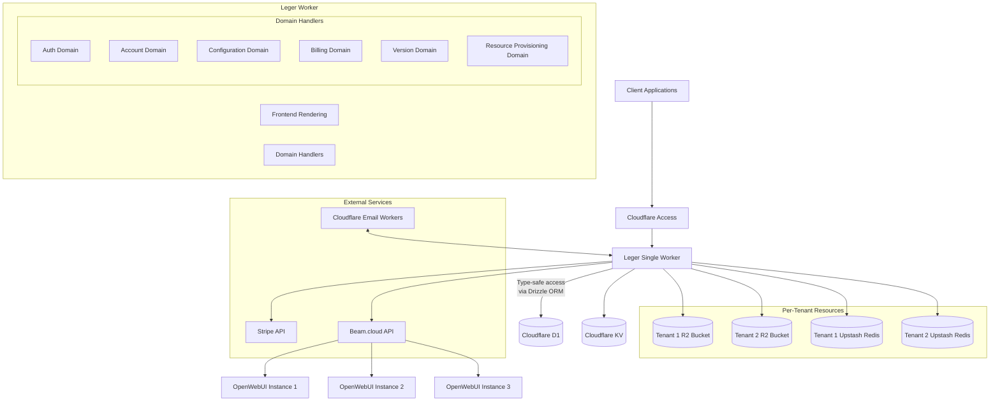
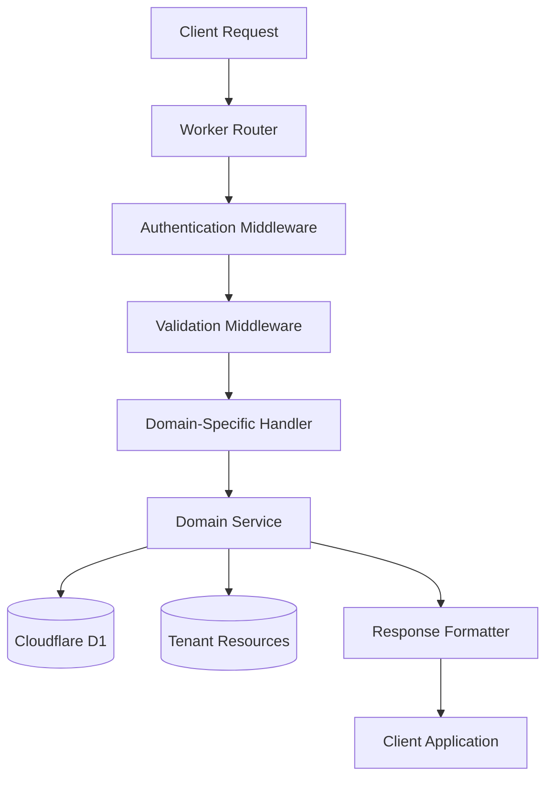

# System Overview

Leger is a configuration management platform that operates on a SaaS model, allowing users to create, store, share, and version configurations for OpenWebUI deployments. The system follows a multi-tenant architecture where users can have personal accounts and belong to multiple team accounts. The platform implements a subscription-based business model with tiered pricing and a free trial period.

## Architecture Diagram



## Core Business Domain

The primary purpose of Leger is to provide:

1. **Configuration management** with versioning capabilities for OpenWebUI
2. **Configuration templates** that can be shared and reused
3. **Team collaboration** through shared accounts
4. **Subscription-based access** to advanced features
5. **Dedicated resources** for each tenant account
6. **Seamless deployment** to Beam.cloud for OpenWebUI instances

## Single Worker Architecture

Leger employs a single Cloudflare Worker architecture that handles both frontend and backend responsibilities:

1. **Frontend Rendering**: The Worker serves the React application and handles client-side rendering
2. **Domain Handlers**: Business logic is organized by domain rather than technical layer
3. **Type-Safe Data Access**: Drizzle ORM provides type-safe access to Cloudflare D1
4. **Authentication Integration**: Cloudflare Access handles identity and authentication
5. **Edge Caching**: Strategic caching for optimal performance at the edge

This approach provides several advantages:
- Simplified deployment and maintenance
- Consistent type safety across frontend and backend
- Reduced latency through edge computing
- Streamlined development workflow

## Domain-Driven Design

The business logic within the single Worker is organized according to domain-driven design principles:

1. **Auth Domain**: Handles Cloudflare Access integration and user profile management
2. **Account Domain**: Manages account creation, team membership, and invitations
3. **Configuration Domain**: Core functionality for storing and managing configuration data
4. **Version Domain**: Tracks configuration history and provides comparison capabilities
5. **Billing Domain**: Manages subscription lifecycle and feature access
6. **Provisioning Domain**: Handles tenant-specific resource provisioning

Each domain contains its own:
- Route handlers
- Service logic
- Validation schemas
- Type definitions

```markdown
## Worker Structure and Request Flow

The Worker follows a structured request processing pipeline to ensure consistent handling of all operations:



1. **Router**: Matches incoming requests to appropriate domain handlers
2. **Middleware Pipeline**:
   - Authentication: Verifies Cloudflare Access JWT and maps to user
   - Validation: Uses Zod schemas to validate request data
   - Authorization: Checks permissions based on account role and subscription
3. **Domain Handler**: Extracts necessary data and calls domain service
4. **Service Layer**: Executes business logic with error handling
5. **Data Access**: Performs database operations via Drizzle ORM
6. **Response Formatting**: Creates consistent response structure

This workflow ensures that:
- All requests follow a consistent processing pattern
- Validation occurs before business logic execution
- Error handling is uniform across all domains
- Type safety is maintained throughout the request lifecycle

### Error Handling Strategy

Errors are handled consistently throughout the Worker:

1. **Standard Error Format**:
```json
{
  "error": {
    "code": "ERROR_CODE",
    "message": "Human-readable error message",
    "request_id": "unique-request-id",
    "validation": [...]  // Optional validation details
  }
}
```

2. **Error Propagation**:
   - Domain-specific errors are created in the service layer
   - A central error middleware catches and formats all errors
   - Request IDs are preserved for troubleshooting
   - Appropriate HTTP status codes are set based on error type

3. **Error Categories**:
   - Validation errors (400): Invalid input data
   - Authentication errors (401): Invalid or missing JWT
   - Authorization errors (403): Insufficient permissions
   - Not found errors (404): Resource doesn't exist
   - Quota errors (429): Rate or resource limits exceeded
   - Server errors (500): Unexpected system failures

## Worker Optimization Techniques

The single Worker architecture employs several optimization techniques:

1. **Lightweight Router**: Simple path-based routing using a trie structure for efficiency
2. **Selective Middleware**: Middleware functions that run only for applicable routes
3. **Response Streaming**: Streaming large responses where appropriate
4. **Cold Start Optimization**: Minimizing dependencies to reduce cold start times
5. **Bundle Size Management**: Code splitting and tree shaking to keep Worker size within limits
6. **Connection Pooling**: Efficient reuse of database connections within request context
7. **Strategic Caching**: Response caching with appropriate cache invalidation
8. **Tenant Isolation**: Ensuring multi-tenant operations maintain proper isolation

These optimizations ensure the Worker remains performant even as the application grows, while maintaining the simplicity of a single deployment unit.

## Multi-Tenant Resource Provisioning

A key feature of Leger is its ability to provision dedicated resources for each tenant account:

1. **Isolated Storage**: Each account receives its own:
   - Dedicated R2 bucket for object storage
   - Dedicated Upstash Redis instance for caching and session management

2. **Resource Provisioning Flow**:
   - Triggered automatically during account creation
   - Resources are tagged with the account identifier
   - Access controls ensure tenant isolation
   - Resource limits aligned with subscription tier

3. **Resource Mapping**:
   - Account-to-resource mappings stored in D1
   - Worker maintains an in-memory cache of mappings
   - Dynamic resolution of resource endpoints

This approach ensures complete data isolation between tenants while maintaining the operational simplicity of a single Worker architecture.

## Data Flow

The typical data flow in the Leger system follows these patterns:

1. **Authentication Flow**:
   - User authenticates through Cloudflare Access
   - Worker receives authenticated request with identity information
   - Worker maps Cloudflare identity to internal account records
   - Authorization checks enforce proper access controls

2. **Configuration Management Flow**:
   - User creates or updates a configuration
   - Frontend validates input using Zod schemas
   - Worker processes request and validates again server-side
   - Worker creates versioned record in D1
   - Response includes updated configuration data

3. **Deployment Flow**:
   - User initiates deployment of a configuration
   - Worker transforms configuration to deployment parameters
   - Worker calls Beam.cloud API to create OpenWebUI instance
   - Status updates retrieved and displayed to user

4. **Resource Access Flow**:
   - User operation requires tenant-specific resource
   - Worker looks up resource mapping for the tenant
   - Worker connects to appropriate isolated resource
   - Data isolation ensures security between tenants

## Integration Points

Leger integrates with several external services:

1. **Cloudflare Access**: For authentication and identity management
2. **Stripe**: For subscription and billing management
3. **Beam.cloud**: For deploying and managing OpenWebUI instances
4. **Cloudflare Email Workers**: For transactional emails

Each integration is handled through standardized interfaces within the Worker, with proper error handling and retry mechanisms.
