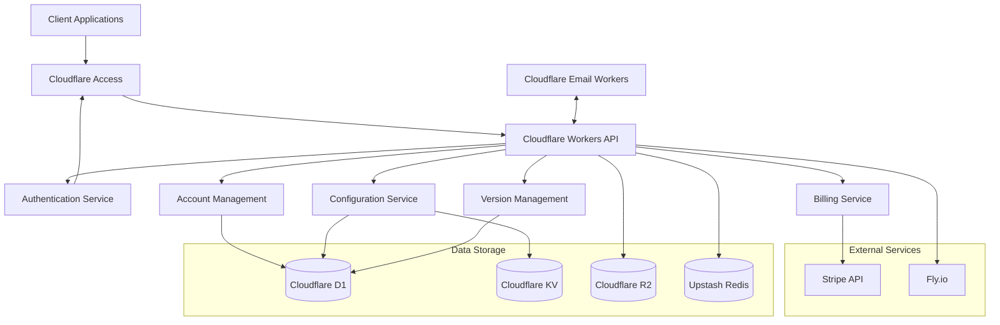

## System Overview

Leger is a configuration management platform that operates on a SaaS model, allowing users to create, store, share, and version configurations. The system follows a multi-tenant architecture where users can have personal accounts and belong to multiple team accounts. The platform implements a subscription-based business model with a single pricing tier and a free trial period.

### Core Business Domain

The primary purpose of Leger is to provide:

1. Configuration management with versioning capabilities
2. Configuration templates that can be shared and reused
3. Team collaboration through shared accounts
4. Subscription-based access to advanced features

### Major Subsystems

The Leger system consists of several interconnected subsystems:

1. **Authentication & User Management**: Handles user identity, authentication, and profile management
2. **Account Management**: Manages personal and team accounts, including invitations and member roles
3. **Configuration Management**: Core functionality for storing and managing configuration data
4. **Version Management**: Tracks configuration history and provides comparison capabilities
5. **Billing & Subscription**: Manages subscription lifecycle and feature access
6. **External Integrations**: Connects with services like Stripe for payment processing

