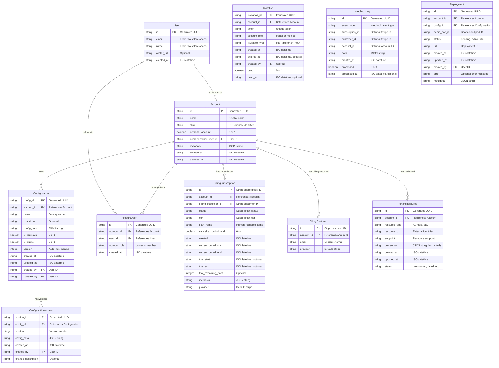

# Data Models

## Entity Relationship Diagram



## Drizzle ORM Schema Definitions

The data models are implemented using Drizzle ORM, providing type-safe access to Cloudflare D1. Below are the schema definitions for the core entities:

### User Schema

```typescript
// db/schema/users.ts
import { sqliteTable, text, integer } from 'drizzle-orm/sqlite-core';
import { createId } from '@paralleldrive/cuid2';

export const users = sqliteTable('users', {
  id: text('id').primaryKey().$defaultFn(() => createId()),
  email: text('email').notNull().unique(),
  name: text('name'),
  avatar_url: text('avatar_url'),
  created_at: text('created_at').$defaultFn(() => new Date().toISOString()),
});
```

### Account Schema

```typescript
// db/schema/accounts.ts
import { sqliteTable, text, integer } from 'drizzle-orm/sqlite-core';
import { createId } from '@paralleldrive/cuid2';
import { users } from './users';

export const accounts = sqliteTable('accounts', {
  id: text('id').primaryKey().$defaultFn(() => createId()),
  name: text('name').notNull(),
  slug: text('slug').unique(),
  personal_account: integer('personal_account', { mode: 'boolean' }).notNull().default(false),
  primary_owner_user_id: text('primary_owner_user_id').notNull().references(() => users.id),
  metadata: text('metadata', { mode: 'json' }).default('{}'),
  created_at: text('created_at').$defaultFn(() => new Date().toISOString()),
  updated_at: text('updated_at').$defaultFn(() => new Date().toISOString()),
});

export const accountUsers = sqliteTable('account_users', {
  id: text('id').primaryKey().$defaultFn(() => createId()),
  account_id: text('account_id').notNull().references(() => accounts.id),
  user_id: text('user_id').notNull().references(() => users.id),
  account_role: text('account_role').notNull().default('member'), // 'owner' or 'member'
  created_at: text('created_at').$defaultFn(() => new Date().toISOString()),
});
```

### Configuration Schema

```typescript
// db/schema/configurations.ts
import { sqliteTable, text, integer } from 'drizzle-orm/sqlite-core';
import { createId } from '@paralleldrive/cuid2';
import { accounts } from './accounts';
import { users } from './users';

export const configurations = sqliteTable('configurations', {
  config_id: text('config_id').primaryKey().$defaultFn(() => createId()),
  account_id: text('account_id').notNull().references(() => accounts.id),
  name: text('name').notNull(),
  description: text('description'),
  config_data: text('config_data', { mode: 'json' }).notNull().default('{}'),
  is_template: integer('is_template', { mode: 'boolean' }).notNull().default(false),
  is_public: integer('is_public', { mode: 'boolean' }).notNull().default(false),
  version: integer('version').notNull().default(1),
  created_at: text('created_at').$defaultFn(() => new Date().toISOString()),
  updated_at: text('updated_at').$defaultFn(() => new Date().toISOString()),
  created_by: text('created_by').references(() => users.id),
  updated_by: text('updated_by').references(() => users.id),
});

export const configurationVersions = sqliteTable('configuration_versions', {
  version_id: text('version_id').primaryKey().$defaultFn(() => createId()),
  config_id: text('config_id').notNull().references(() => configurations.config_id),
  version: integer('version').notNull(),
  config_data: text('config_data', { mode: 'json' }).notNull(),
  created_at: text('created_at').$defaultFn(() => new Date().toISOString()),
  created_by: text('created_by').references(() => users.id),
  change_description: text('change_description'),
});
```

### Billing Schema

```typescript
// db/schema/billing.ts
import { sqliteTable, text, integer } from 'drizzle-orm/sqlite-core';
import { accounts } from './accounts';

export const billingCustomers = sqliteTable('billing_customers', {
  id: text('id').primaryKey(), // Stripe customer ID
  account_id: text('account_id').notNull().references(() => accounts.id).unique(),
  email: text('email').notNull(),
  provider: text('provider').notNull().default('stripe'),
});

export const billingSubscriptions = sqliteTable('billing_subscriptions', {
  id: text('id').primaryKey(), // Stripe subscription ID
  account_id: text('account_id').notNull().references(() => accounts.id),
  billing_customer_id: text('billing_customer_id').notNull().references(() => billingCustomers.id),
  status: text('status').notNull(),
  tier: text('tier').notNull().default('standard'),
  plan_name: text('plan_name').notNull(),
  cancel_at_period_end: integer('cancel_at_period_end', { mode: 'boolean' }).notNull().default(false),
  created: text('created').notNull(),
  current_period_start: text('current_period_start').notNull(),
  current_period_end: text('current_period_end').notNull(),
  trial_start: text('trial_start'),
  trial_end: text('trial_end'),
  trial_remaining_days: integer('trial_remaining_days'),
  metadata: text('metadata', { mode: 'json' }).default('{}'),
  provider: text('provider').notNull().default('stripe'),
});
```

### Tenant Resources Schema

```typescript
// db/schema/tenant-resources.ts
import { sqliteTable, text, integer } from 'drizzle-orm/sqlite-core';
import { createId } from '@paralleldrive/cuid2';
import { accounts } from './accounts';

export const tenantResources = sqliteTable('tenant_resources', {
  id: text('id').primaryKey().$defaultFn(() => createId()),
  account_id: text('account_id').notNull().references(() => accounts.id),
  resource_type: text('resource_type').notNull(), // 'r2', 'redis', etc.
  resource_id: text('resource_id').notNull(), // External identifier
  endpoint: text('endpoint').notNull(), // Resource endpoint
  credentials: text('credentials', { mode: 'json' }).notNull(), // Encrypted
  created_at: text('created_at').$defaultFn(() => new Date().toISOString()),
  updated_at: text('updated_at').$defaultFn(() => new Date().toISOString()),
  status: text('status').notNull().default('provisioning'), // 'provisioning', 'provisioned', 'failed'
});
```

### Deployment Schema

```typescript
// db/schema/deployments.ts
import { sqliteTable, text, integer } from 'drizzle-orm/sqlite-core';
import { createId } from '@paralleldrive/cuid2';
import { accounts } from './accounts';
import { configurations } from './configurations';
import { users } from './users';

export const deployments = sqliteTable('deployments', {
  id: text('id').primaryKey().$defaultFn(() => createId()),
  account_id: text('account_id').notNull().references(() => accounts.id),
  config_id: text('config_id').notNull().references(() => configurations.config_id),
  beam_pod_id: text('beam_pod_id'),
  status: text('status').notNull().default('pending'), // 'pending', 'active', 'failed', 'stopped'
  url: text('url'),
  created_at: text('created_at').$defaultFn(() => new Date().toISOString()),
  updated_at: text('updated_at').$defaultFn(() => new Date().toISOString()),
  created_by: text('created_by').references(() => users.id),
  error: text('error'),
  metadata: text('metadata', { mode: 'json' }).default('{}'),
});
```

## Drizzle ORM Best Practices from SaaS Stack

To optimize the Drizzle ORM implementation for Cloudflare D1, the following patterns should be adopted:

### Connection Management

```typescript
// db/index.ts
import { drizzle } from "drizzle-orm/d1";
import * as schema from "./schema";

// Create a global drizzle instance
export const db = drizzle(process.env.DATABASE, { schema });

// For efficient usage in transaction blocks
export async function withTransaction<T>(
  callback: (tx: typeof db) => Promise<T>
): Promise<T> {
  return db.transaction(async (tx) => {
    return await callback(tx);
  });
}
```

### Query Building and Execution

```typescript
// Example efficient repository pattern
// repositories/configurations.ts
import { eq, and, desc } from "drizzle-orm";
import { db, withTransaction } from "../db";
import { configurations, configurationVersions } from "../db/schema";
import type { Configuration, ConfigurationVersion } from "../types";

export async function getConfigurationsByAccount(accountId: string): Promise<Configuration[]> {
  return await db
    .select()
    .from(configurations)
    .where(eq(configurations.account_id, accountId))
    .orderBy(desc(configurations.updated_at));
}

export async function createConfigurationWithVersion(
  data: Omit<Configuration, "config_id" | "created_at" | "updated_at" | "version">,
  versionData: Omit<ConfigurationVersion, "version_id" | "created_at" | "version">
): Promise<Configuration> {
  return await withTransaction(async (tx) => {
    const [config] = await tx
      .insert(configurations)
      .values({
        account_id: data.account_id,
        name: data.name,
        description: data.description,
        config_data: data.config_data,
        is_template: data.is_template || false,
        is_public: data.is_public || false,
        created_by: data.created_by,
        updated_by: data.created_by,
      })
      .returning();

    await tx.insert(configurationVersions).values({
      config_id: config.config_id,
      version: 1,
      config_data: data.config_data,
      created_by: data.created_by,
      change_description: versionData.change_description || "Initial version",
    });

    return config;
  });
}
```

### Efficient Relation Handling

For better query performance with D1, implement manual joins when needed:

```typescript
// Example efficient relation query
// repositories/accounts.ts
import { eq } from "drizzle-orm";
import { db } from "../db";
import { accounts, accountUsers, users } from "../db/schema";
import type { AccountWithMembers } from "../types";

export async function getAccountWithMembers(accountId: string): Promise<AccountWithMembers | null> {
  const account = await db
    .select()
    .from(accounts)
    .where(eq(accounts.id, accountId))
    .limit(1)
    .then((rows) => rows[0] || null);

  if (!account) return null;

  const members = await db
    .select({
      user_id: users.id,
      name: users.name,
      email: users.email,
      role: accountUsers.account_role,
    })
    .from(accountUsers)
    .innerJoin(users, eq(accountUsers.user_id, users.id))
    .where(eq(accountUsers.account_id, accountId));

  return {
    ...account,
    members,
  };
}
```

### Pagination Implementation

Implement efficient cursor-based pagination for large dataset queries:

```typescript
// Example cursor pagination
// repositories/deployments.ts
import { eq, and, lt, desc } from "drizzle-orm";
import { db } from "../db";
import { deployments } from "../db/schema";
import type { PaginatedResult, Deployment } from "../types";

export async function getDeploymentsPaginated(
  accountId: string,
  cursor?: string,
  limit = 20
): Promise<PaginatedResult<Deployment>> {
  const query = db
    .select()
    .from(deployments)
    .where(eq(deployments.account_id, accountId))
    .orderBy(desc(deployments.created_at))
    .limit(limit + 1);

  if (cursor) {
    query.where(lt(deployments.created_at, cursor));
  }

  const results = await query;
  const hasNextPage = results.length > limit;
  const data = hasNextPage ? results.slice(0, -1) : results;
  
  return {
    data,
    hasNextPage,
    nextCursor: hasNextPage ? data[data.length - 1]?.created_at : undefined,
  };
}
```

### Optimized Batch Operations

For batch operations, utilize SQLite's efficient mechanisms:

```typescript
// Example batch insert
// repositories/imports.ts
import { db } from "../db";
import { configurations } from "../db/schema";
import type { ConfigurationImport } from "../types";

export async function batchImportConfigurations(
  imports: ConfigurationImport[]
): Promise<void> {
  // Split into chunks to avoid exceeding parameter limits
  const chunkSize = 100;
  for (let i = 0; i < imports.length; i += chunkSize) {
    const chunk = imports.slice(i, i + chunkSize);
    await db.insert(configurations).values(chunk);
  }
}
```

### JSON Handling Utilities

Provide utilities for efficient JSON operations:

```typescript
// utils/json.ts
import { z } from "zod";

export function safeParseJSON<T>(
  jsonString: string,
  schema: z.ZodType<T>
): { success: true; data: T } | { success: false; error: z.ZodError } {
  try {
    const parsed = JSON.parse(jsonString);
    const result = schema.safeParse(parsed);
    return result;
  } catch (error) {
    // Handle JSON.parse errors by returning a ZodError-like structure
    return {
      success: false,
      error: new z.ZodError([
        {
          code: z.ZodIssueCode.custom,
          path: [],
          message: "Invalid JSON string",
        },
      ]),
    };
  }
}

export function safeStringifyJSON(data: unknown): string {
  try {
    return JSON.stringify(data);
  } catch (error) {
    console.error("Error stringifying JSON:", error);
    return "{}";
  }
}
```
```

### Addition: Add this content after the "## Data Access Patterns" section

```markdown
## Scheduled Data Operations

For operations that need to run on a schedule (such as cleanups, aggregations, or metrics collection), leverage Cloudflare's Cron Triggers:

```typescript
// workers/scheduled-tasks.ts
export default {
  async scheduled(event, env, ctx) {
    const { cron } = event;
    console.log(`Running scheduled task: ${cron}`);

    switch (cron) {
      case "*/30 * * * *": // Every 30 minutes
        await cleanupExpiredSessions(env.DATABASE);
        break;
      case "0 0 * * *": // Daily at midnight
        await generateDailyMetrics(env.DATABASE);
        break;
      case "0 2 * * 0": // Weekly on Sunday at 2 AM
        await cleanupOldVersions(env.DATABASE);
        break;
    }
  },
};

async function cleanupExpiredSessions(db) {
  const now = new Date().getTime();
  await db.delete(sessions).where(lt(sessions.expires, now));
}

async function generateDailyMetrics(db) {
  // Aggregate usage data for the previous day
  const yesterday = new Date();
  yesterday.setDate(yesterday.getDate() - 1);
  const startOfDay = new Date(yesterday.setHours(0, 0, 0, 0)).toISOString();
  const endOfDay = new Date(yesterday.setHours(23, 59, 59, 999)).toISOString();

  // Example aggregation
  const result = await db
    .select({
      account_id: deployments.account_id,
      count: sql`count(*)`.mapWith(Number),
    })
    .from(deployments)
    .where(
      and(
        gte(deployments.created_at, startOfDay),
        lte(deployments.created_at, endOfDay)
      )
    )
    .groupBy(deployments.account_id);

  // Store metrics
  for (const row of result) {
    await db.insert(accountMetrics).values({
      account_id: row.account_id,
      date: startOfDay.split("T")[0],
      deployment_count: row.count,
    });
  }
}

async function cleanupOldVersions(db) {
  // Find configurations with more than 50 versions
  const configurationsWithManyVersions = await db
    .select({
      config_id: configurationVersions.config_id,
      count: sql`count(*)`.mapWith(Number),
    })
    .from(configurationVersions)
    .groupBy(configurationVersions.config_id)
    .having(sql`count(*) > 50`);

  // For each configuration, keep the 50 most recent versions
  for (const config of configurationsWithManyVersions) {
    const versionsToKeep = await db
      .select()
      .from(configurationVersions)
      .where(eq(configurationVersions.config_id, config.config_id))
      .orderBy(desc(configurationVersions.created_at))
      .limit(50);

    const oldestVersionToKeep = versionsToKeep[versionsToKeep.length - 1];

    // Delete older versions
    if (oldestVersionToKeep) {
      await db
        .delete(configurationVersions)
        .where(
          and(
            eq(configurationVersions.config_id, config.config_id),
            lt(configurationVersions.created_at, oldestVersionToKeep.created_at)
          )
        );
    }
  }
}
```

## Effective Error Handling in Database Operations

Implement consistent error handling patterns for database operations:

```typescript
// utils/db-error.ts
import { DrizzleError } from "drizzle-orm";

export class DatabaseError extends Error {
  constructor(
    message: string,
    public cause: unknown,
    public code?: string
  ) {
    super(message);
    this.name = "DatabaseError";
  }

  static fromError(error: unknown): DatabaseError {
    if (error instanceof DrizzleError) {
      return new DatabaseError(
        "Database operation failed",
        error,
        "DB_OPERATION_FAILED"
      );
    }

    if (error instanceof Error) {
      // SQLite specific error handling
      if (error.message.includes("UNIQUE constraint failed")) {
        return new DatabaseError(
          "Resource already exists with the same unique identifier",
          error,
          "UNIQUE_VIOLATION"
        );
      }

      if (error.message.includes("FOREIGN KEY constraint failed")) {
        return new DatabaseError(
          "Referenced resource does not exist",
          error,
          "FOREIGN_KEY_VIOLATION"
        );
      }
    }

    return new DatabaseError(
      "Unexpected database error",
      error,
      "UNKNOWN_DB_ERROR"
    );
  }
}

// Example usage in a repository
export async function createUser(userData: UserInput): Promise<User> {
  try {
    const [user] = await db
      .insert(users)
      .values(userData)
      .returning();
    return user;
  } catch (error) {
    throw DatabaseError.fromError(error);
  }
}
```
```

## Data Access Patterns

The application uses Drizzle ORM to interact with the Cloudflare D1 database. This provides type-safe queries and ensures data integrity through the type system.

### Example Query Patterns

```typescript
// Retrieving a user's accounts
const getUserAccounts = async (userId: string) => {
  return await db
    .select({
      account: accounts,
      role: accountUsers.account_role,
    })
    .from(accounts)
    .innerJoin(accountUsers, eq(accounts.id, accountUsers.account_id))
    .where(eq(accountUsers.user_id, userId));
};

// Creating a new configuration
const createConfiguration = async (data, userId: string, accountId: string) => {
  return await db.transaction(async (tx) => {
    // Create the configuration
    const [config] = await tx
      .insert(configurations)
      .values({
        account_id: accountId,
        name: data.name,
        description: data.description,
        config_data: data.config_data,
        is_template: data.is_template || false,
        is_public: data.is_public || false,
        created_by: userId,
        updated_by: userId,
      })
      .returning();

    // Create initial version
    await tx.insert(configurationVersions).values({
      config_id: config.config_id,
      version: 1,
      config_data: data.config_data,
      created_by: userId,
      change_description: 'Initial version',
    });

    return config;
  });
};
```

## Business Rules and Data Validation

Data validation is implemented at multiple levels:

1. **Frontend Validation**: Using Zod schemas with React Hook Form
2. **Worker Validation**: Server-side validation using the same Zod schemas
3. **Database Constraints**: SQL constraints enforced by D1
4. **Application Logic**: Additional business rules enforced in code

### Shared Zod Schemas

```typescript
// shared/validation/configuration.schema.ts
import { z } from 'zod';

export const configurationSchema = z.object({
  name: z.string().min(1, "Name is required").max(255),
  description: z.string().optional(),
  config_data: z.record(z.any()).default({}),
  is_template: z.boolean().optional().default(false),
  is_public: z.boolean().optional().default(false),
});

export const configurationUpdateSchema = configurationSchema.partial();

export type ConfigurationInput = z.infer<typeof configurationSchema>;
export type ConfigurationUpdateInput = z.infer<typeof configurationUpdateSchema>;
```

## Multi-Tenant Resource Management

The `tenant_resources` table tracks dedicated resources provisioned for each tenant:

1. **Resource Provisioning**: When a new account is created, the system automatically provisions:
   - A dedicated R2 bucket for file storage
   - A dedicated Upstash Redis instance for caching

2. **Resource Access**: When a request needs to access a tenant-specific resource:
   - The Worker queries the tenant_resources table
   - The appropriate endpoint and credentials are retrieved
   - The Worker connects to the resource using these credentials

3. **Resource Lifecycle**: Resources follow the same lifecycle as the account:
   - Created during account provisioning
   - Updated if needed during subscription changes
   - Resources are retained when accounts are deactivated (for potential recovery)

This approach ensures complete data isolation between tenants while maintaining the operational benefits of a single Worker architecture.
