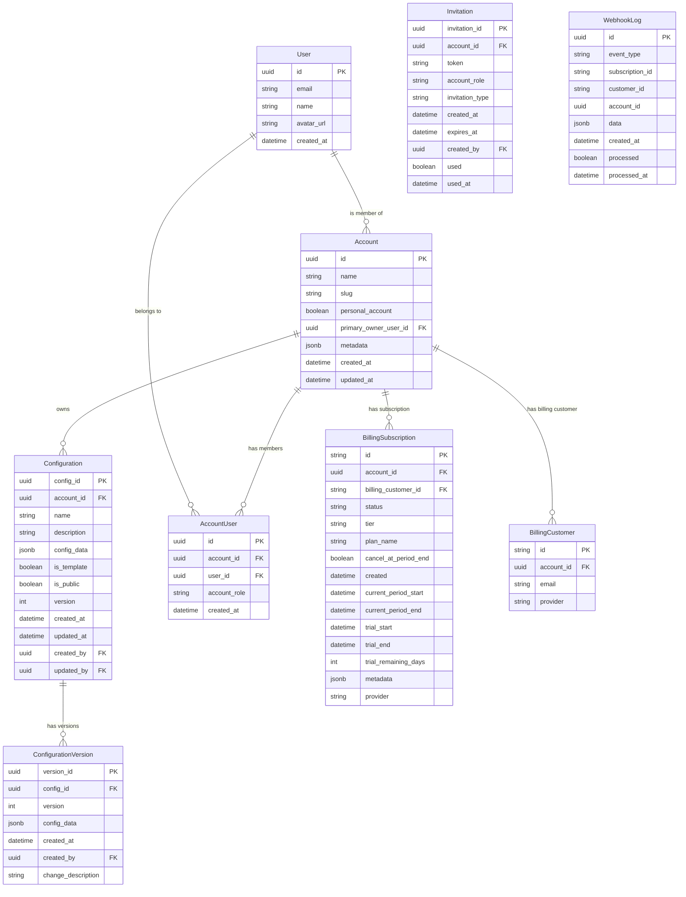

## Data Models

# Detailed Data Models

## User

The User entity represents an authenticated user of the system.

| Field | Type | Description | Validation |
|-------|------|-------------|------------|
| `id` | UUID | Primary key, unique identifier | Auto-generated |
| `email` | String | User's email address | Valid email format, unique |
| `name` | String | User's display name | Optional |
| `avatar_url` | String | URL to user's avatar image | Optional, valid URL format |
| `created_at` | DateTime | Account creation timestamp | Auto-generated |

**Relationships:**
- A User can be a member of multiple Accounts through AccountUser
- A User can create/update Configurations and Versions (tracked in audit fields)

**Indexing:**
- Primary key on `id`
- Unique index on `email` for fast lookups

## Account

The Account entity represents either a personal or team account.

| Field | Type | Description | Validation |
|-------|------|-------------|------------|
| `id` | UUID | Primary key, unique identifier | Auto-generated |
| `name` | String | Account display name | Required, not empty |
| `slug` | String | URL-friendly account identifier | Optional, URL-safe characters, unique |
| `personal_account` | Boolean | Whether this is a personal account | Required |
| `primary_owner_user_id` | UUID | References the primary owner | Required, valid User ID |
| `metadata` | JSON | Custom account metadata | Optional |
| `created_at` | DateTime | Account creation timestamp | Auto-generated |
| `updated_at` | DateTime | Last update timestamp | Auto-updated |

**Relationships:**
- An Account has many User members through AccountUser junction table
- An Account owns many Configurations
- An Account can have one BillingCustomer
- An Account can have many BillingSubscriptions (historical record)

**Indexing:**
- Primary key on `id`
- Index on `primary_owner_user_id` for fast ownership lookups
- Unique index on `slug` if provided

**Business Rules:**
- Personal accounts are automatically created during user registration
- Team accounts are created explicitly by users
- Every account must have at least one owner role
- The primary owner cannot be removed from the account

## AccountUser

Junction table representing the membership of a User in an Account.

| Field | Type | Description | Validation |
|-------|------|-------------|------------|
| `id` | UUID | Primary key, unique identifier | Auto-generated |
| `account_id` | UUID | References the Account | Required, valid Account ID |
| `user_id` | UUID | References the User | Required, valid User ID |
| `account_role` | String | User's role in the account | Required, one of: "owner", "member" |
| `created_at` | DateTime | Membership creation timestamp | Auto-generated |

**Relationships:**
- Links User to Account with a specific role

**Indexing:**
- Primary key on `id`
- Composite index on (`account_id`, `user_id`) for fast lookups and enforcing uniqueness
- Index on `user_id` for finding a user's accounts

**Business Rules:**
- Valid roles are limited to "owner" and "member"
- A user cannot have duplicate memberships in the same account
- The primary owner of an account must have the "owner" role

## Configuration

The Configuration entity stores the latest version of configuration data.

| Field | Type | Description | Validation |
|-------|------|-------------|------------|
| `config_id` | UUID | Primary key, unique identifier | Auto-generated |
| `account_id` | UUID | Account that owns this configuration | Required, valid Account ID |
| `name` | String | Configuration display name | Required, not empty |
| `description` | String | Configuration description | Optional |
| `config_data` | JSON | The actual configuration data | Required, valid JSON |
| `is_template` | Boolean | Whether this is a template configuration | Required, default false |
| `is_public` | Boolean | Whether this configuration is publicly accessible | Required, default false |
| `version` | Integer | Current version number | Required, default 1, auto-incremented |
| `created_at` | DateTime | Creation timestamp | Auto-generated |
| `updated_at` | DateTime | Last update timestamp | Auto-updated |
| `created_by` | UUID | User who created this configuration | Optional, valid User ID |
| `updated_by` | UUID | User who last updated this configuration | Optional, valid User ID |

**Relationships:**
- Belongs to an Account
- Has many ConfigurationVersions as history
- Related to Users through audit fields

**Indexing:**
- Primary key on `config_id`
- Index on `account_id` for listing account configurations
- Composite index on (`is_template`, `is_public`) for filtering public templates

**Business Rules:**
- When a configuration is updated, the previous state is stored as a ConfigurationVersion
- Templates can be marked as public to be shared across accounts
- Version number is automatically incremented on each update to config_data
- Free tier accounts have a limit on the number of configurations they can create

## ConfigurationVersion

The ConfigurationVersion entity stores historical versions of configuration data.

| Field | Type | Description | Validation |
|-------|------|-------------|------------|
| `version_id` | UUID | Primary key, unique identifier | Auto-generated |
| `config_id` | UUID | References the parent Configuration | Required, valid Configuration ID |
| `version` | Integer | Version number | Required, positive integer |
| `config_data` | JSON | The configuration data at this version | Required, valid JSON |
| `created_at` | DateTime | Version creation timestamp | Auto-generated |
| `created_by` | UUID | User who created this version | Optional, valid User ID |
| `change_description` | String | Description of changes in this version | Optional |

**Relationships:**
- Belongs to a Configuration
- Optional relation to User who created the version

**Indexing:**
- Primary key on `version_id`
- Index on `config_id` for listing versions of a configuration
- Composite index on (`config_id`, `version`) for quickly finding specific versions

**Business Rules:**
- Versions are immutable once created
- A new version is created automatically when the parent configuration's data is updated
- When restoring from a previous version, a new version is created (not reverting to an old one)

## BillingCustomer

The BillingCustomer entity links an Account to a Stripe customer.

| Field | Type | Description | Validation |
|-------|------|-------------|------------|
| `id` | String | Primary key, Stripe customer ID | Required |
| `account_id` | UUID | References the Account | Required, valid Account ID |
| `email` | String | Customer email address | Required, valid email |
| `provider` | String | Billing provider name | Required, default "stripe" |

**Relationships:**
- Belongs to an Account
- Related to BillingSubscriptions

**Indexing:**
- Primary key on `id`
- Unique index on `account_id` (one Stripe customer per account)

**Business Rules:**
- Created during the first checkout process
- Email is synchronized with the account owner's email

## BillingSubscription

The BillingSubscription entity tracks subscription status and details.

| Field | Type | Description | Validation |
|-------|------|-------------|------------|
| `id` | String | Primary key, Stripe subscription ID | Required |
| `account_id` | UUID | References the Account | Required, valid Account ID |
| `billing_customer_id` | String | References the BillingCustomer | Required |
| `status` | String | Subscription status | Required, one of predefined statuses |
| `tier` | String | Subscription tier name | Required, default "standard" |
| `plan_name` | String | Human-readable plan name | Required |
| `cancel_at_period_end` | Boolean | Whether subscription will cancel at period end | Required, default false |
| `created` | DateTime | Subscription creation timestamp | Required |
| `current_period_start` | DateTime | Start of current billing period | Required |
| `current_period_end` | DateTime | End of current billing period | Required |
| `trial_start` | DateTime | Start of trial period | Optional |
| `trial_end` | DateTime | End of trial period | Optional |
| `trial_remaining_days` | Integer | Days remaining in trial | Optional |
| `metadata` | JSON | Additional subscription metadata | Optional |
| `provider` | String | Billing provider name | Required, default "stripe" |

**Relationships:**
- Belongs to an Account
- Related to a BillingCustomer

**Indexing:**
- Primary key on `id`
- Index on `account_id` for finding account subscriptions
- Index on `status` for filtering by status

**Business Rules:**
- Valid statuses include: "active", "trialing", "past_due", "canceled", "incomplete", "incomplete_expired"
- Only the most recent subscription record for an account is considered active
- Trial periods are 14 days by default for new users
- When subscription status changes, a new record may be created or existing one updated (based on webhook)

## Invitation

The Invitation entity represents an invitation to join an Account.

| Field | Type | Description | Validation |
|-------|------|-------------|------------|
| `invitation_id` | UUID | Primary key, unique identifier | Auto-generated |
| `account_id` | UUID | References the Account | Required, valid Account ID |
| `token` | String | Unique invitation token | Required, auto-generated, unique |
| `account_role` | String | Role to grant on acceptance | Required, one of: "owner", "member" |
| `invitation_type` | String | Type of invitation | Required, one of: "one_time", "24_hour" |
| `created_at` | DateTime | Creation timestamp | Auto-generated |
| `expires_at` | DateTime | Expiration timestamp | Required, calculated based on type |
| `created_by` | UUID | User who created the invitation | Required, valid User ID |
| `used` | Boolean | Whether invitation has been used | Required, default false |
| `used_at` | DateTime | When invitation was accepted | Optional |

**Relationships:**
- Belongs to an Account
- Created by a User

**Indexing:**
- Primary key on `invitation_id`
- Unique index on `token` for secure lookups
- Index on `account_id` for listing account invitations

**Business Rules:**
- "one_time" invitations never expire until used
- "24_hour" invitations expire after 24 hours
- Only account owners can create invitations
- Invitations can only be used once
- Expired or used invitations cannot be accepted

## WebhookLog

The WebhookLog entity logs webhook events from external services.

| Field | Type | Description | Validation |
|-------|------|-------------|------------|
| `id` | UUID | Primary key, unique identifier | Auto-generated |
| `event_type` | String | Type of webhook event | Required |
| `subscription_id` | String | Related subscription ID | Optional |
| `customer_id` | String | Related customer ID | Optional |
| `account_id` | UUID | Related account ID | Optional |
| `data` | JSON | Full webhook event data | Required |
| `created_at` | DateTime | Event receipt timestamp | Auto-generated |
| `processed` | Boolean | Whether event was processed | Required, default false |
| `processed_at` | DateTime | When event was processed | Optional |

**Relationships:**
- May relate to an Account, BillingSubscription, or BillingCustomer

**Indexing:**
- Primary key on `id`
- Index on `event_type` for filtering by event type
- Index on `created_at` for chronological listing
- Index on `processed` for finding unprocessed events

**Business Rules:**
- All webhook events are logged before processing
- Processing status is updated after successful handling
- Failed processing can be retried
