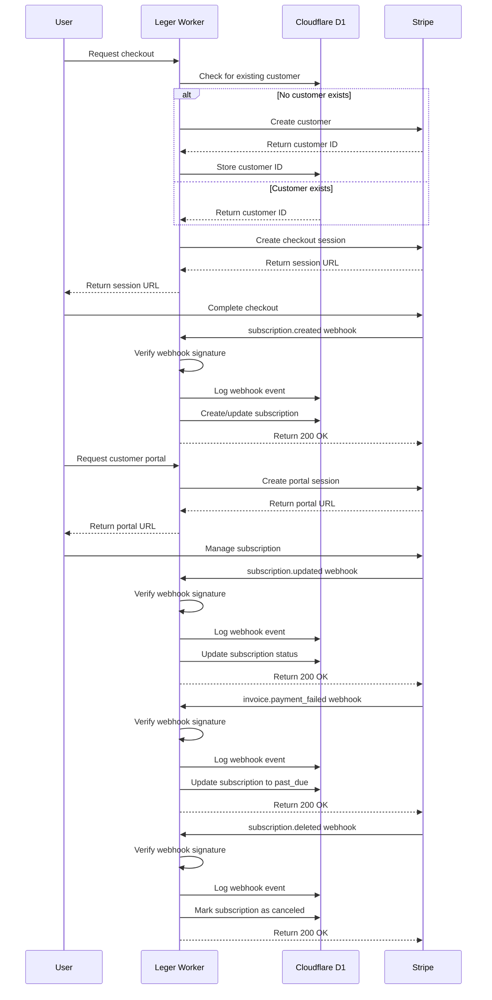

# Business Logic

The business logic in Leger is implemented within the single Cloudflare Worker architecture, organized by domain. This document outlines the key business workflows, rules, and implementation approaches.

## Stripe Integration Workflow



# Core Business Logic

This section documents the essential business functions, rules, workflows, and constraints that form the core logic of the Leger system, implemented within a single Cloudflare Worker using domain-driven design principles.

## Account Management Logic

### User Registration and Account Creation

When a new user authenticates with Cloudflare Access for the first time, several operations are performed automatically:

1. Create a user record with information from the Cloudflare Access JWT
2. Create a personal account for the user with:
   - The user as the primary owner with "owner" role
   - Name derived from the user's name or email
   - `personal_account` flag set to true
3. The new user automatically enters a 14-day trial period with full feature access

**Implementation Approach:**
- Identity information is extracted from Cloudflare Access JWT
- Business logic is encapsulated in the AccountDomain module
- Account creation triggers provisioning of tenant-specific resources

**Business Rules:**
- Email addresses must be unique across all users
- Personal accounts are automatically created and cannot be deleted while the user exists
- Personal accounts can have only one member (the owner)
- All users must have exactly one personal account

### Team Account Management

Team accounts allow multiple users to collaborate on shared configurations.

**Account Creation:**
1. Only authenticated users can create team accounts
2. The creator becomes the primary owner with "owner" role
3. Account name and optional slug must be provided
4. Account slug must be URL-safe and unique across all accounts

**Account Update:**
1. Only account owners can update account details
2. Account name can be modified at any time
3. Account slug can be changed if not already in use
4. Account metadata can be updated, replaced, or merged

**Member Management:**
1. Only account owners can add or remove members
2. Members can be assigned "owner" or "member" roles
3. The primary owner cannot be removed from the account
4. An account must always have at least one owner
5. If an owner attempts to leave, they must transfer primary ownership first
6. Users can be members of multiple accounts simultaneously

**Implementation Approach:**
- Account operations are implemented in the AccountDomain module
- Authorization checks occur in the Worker middleware
- Access control is enforced before processing requests
- Database operations use Drizzle ORM transactions to ensure data consistency

### Invitation Management

Invitations allow account owners to add new members to team accounts.

**Invitation Creation:**
1. Only account owners can create invitations
2. Invitations can specify a role ("owner" or "member")
3. Invitations can be one-time use or time-limited (24-hour)
4. Each invitation has a unique secure token

**Invitation Acceptance:**
1. Invitations can only be used once
2. Expired invitations cannot be accepted
3. Users cannot accept invitations to accounts they already belong to
4. Accepting an invitation creates an AccountUser record with the specified role

**Invitation Management:**
1. Account owners can view all pending invitations for their accounts
2. Account owners can delete any pending invitation
3. Users can look up invitation token details before accepting

**Implementation Approach:**
- Email delivery handled by Cloudflare Email Workers
- Invitation validation implemented in the AccountDomain module
- Secure token generation and verification

## Configuration Management Logic

### Configuration CRUD Operations

**Configuration Creation:**
1. Users can create configurations within any account they belong to
2. A configuration requires a name and is associated with an account
3. Configuration creation is subject to quota limits based on subscription
4. Each configuration starts at version 1
5. Creator is tracked in the `created_by` field

**Configuration Retrieval:**
1. Users can view configurations for accounts they belong to
2. Public templates are visible to all users
3. Non-public templates are visible only to members of the owning account

**Configuration Update:**
1. Account members can update configurations within their accounts
2. Each update to configuration data creates a new version
3. Version number is incremented automatically
4. Previous version is preserved in the version history
5. Last modifier is tracked in the `updated_by` field

**Configuration Deletion:**
1. Account owners can delete configurations
2. Deletion removes the configuration and all its versions
3. Deletion is permanent and cannot be undone

**Implementation Approach:**
- Configuration operations implemented in the ConfigurationDomain module
- Versioning implemented explicitly in Worker code (not via database triggers)
- Transaction-based operations ensure data consistency
- Access control enforced at the application level

### Template Management

Templates are special configurations that can be shared and reused.

**Template Creation:**
1. Users can create templates from existing configurations
2. Templates can be marked as public or private
3. Public templates are accessible to all users
4. Private templates are accessible only to members of the owning account
5. Creating templates requires a paid subscription or active trial

**Template Application:**
1. Users can apply templates to create new configurations
2. Application creates a new configuration based on the template data
3. Users can override specific values during application
4. The new configuration is not linked to the original template after creation

**Implementation Approach:**
- Template operations implemented in the ConfigurationDomain module
- Public template discovery optimized through caching
- Authorization checks for template creation based on subscription

### Version Management

Version management tracks the history of changes to configurations.

**Version Creation:**
1. A new version is created automatically whenever configuration data is updated
2. Each version preserves the complete state of the configuration at that point
3. Version numbers are sequential integers starting from 1
4. Versions include metadata about who made the change and when

**Version Retrieval:**
1. Users can list all versions of a configuration they have access to
2. Users can retrieve a specific version by ID or number
3. Version history provides a complete audit trail of changes

**Version Comparison:**
1. Users can compare any two versions of a configuration
2. Comparison shows added, removed, and modified keys in the configuration data
3. Comparison includes metadata about both versions

**Version Restoration:**
1. Users can restore a configuration to any previous version
2. Restoration creates a new version with the restored data
3. The version number is incremented, not reverted
4. Restoration action is recorded in the version history

**Implementation Approach:**
- Version operations implemented in the VersionDomain module
- Diff computation performed in the Worker
- JSON comparison utilities for efficient difference detection
- Explicit versioning in transaction-based operations

## Multi-Tenant Resource Provisioning Logic

Leger provides dedicated resources for each tenant account, managed through the Resource Provisioning domain.

**Resource Provisioning Flow:**
1. Account creation triggers resource provisioning
2. System creates dedicated resources for the tenant:
   - R2 bucket for object storage
   - Upstash Redis instance for caching
3. Resource identifiers and access details are stored securely
4. Resources are tagged with tenant identifiers for management

**Resource Access Flow:**
1. When a tenant operation requires a specific resource:
   - The Worker looks up resource mapping in D1
   - Resource credentials are retrieved and decrypted
   - Worker connects to the appropriate resource
2. Complete isolation between tenant resources is maintained

**Resource Management:**
1. Resources are scaled based on subscription tier
2. Resource usage is monitored
3. Resources can be reconfigured when subscription changes
4. Resources are preserved during account deactivation

**Implementation Approach:**
- Provisioning implemented in the ResourceProvisioningDomain module
- Credential encryption/decryption handled securely
- Resource pooling for optimal performance
- Background provisioning tasks for non-blocking operation

## Subscription and Billing Logic

### Subscription Management

**Trial Period:**
1. New users automatically receive a 14-day trial with full feature access
2. Trial period begins at user registration
3. Trial status and remaining days are tracked in the subscription record
4. Trial expiration reverts the user to free tier access

**Checkout Process:**
1. Users can initiate subscription checkout from the UI
2. Worker creates or retrieves a Stripe customer for the account
3. Worker creates a Stripe checkout session with the correct pricing ($99/month)
4. After successful checkout, the subscription becomes active
5. If a user already has a subscription, they are redirected to the customer portal

**Subscription Status:**
1. Valid subscription statuses: "active", "trialing", "past_due", "canceled", "incomplete", "incomplete_expired"
2. Only "active" and "trialing" statuses grant full feature access
3. Other statuses may have restricted feature access
4. Free tier status is represented by "no_subscription" (not a database value)

**Subscription Termination:**
1. Users can cancel their subscription through the Stripe customer portal
2. Canceled subscriptions remain active until the end of the current billing period
3. After the billing period ends, the account reverts to free tier access
4. User can resubscribe at any time

### Feature Access Control

The subscription status determines feature access through a layered control system:

**Free Tier Limitations:**
1. Maximum 3 configurations per account
2. Cannot create or share templates
3. Cannot access advanced versioning features
4. Can use templates created by others

**Paid Tier Features:**
1. Maximum 50 configurations per account
2. Can create and share templates
3. Full access to versioning features
4. All collaboration features enabled

**Access Control Functions:**
1. `canCreateConfiguration()` - Checks if the account has reached its configuration limit
2. `canShareConfiguration()` - Checks if the account can create and share templates
3. `canUseAdvancedFeatures()` - Checks access to premium features

**Implementation Approach:**
- Authorization helpers implemented in utility functions
- Feature access checked before each relevant operation
- Clear error messages explain subscription requirements when access is denied

```typescript
// utils/subscription.ts
import { eq } from 'drizzle-orm';
import { billingSubscriptions } from '../db/schema';

// Check if account has access to premium features
export async function hasPremiumAccess(
  accountId: string,
  db: D1Database
): Promise<boolean> {
  const subscription = await db.query.billingSubscriptions.findFirst({
    where: eq(billingSubscriptions.account_id, accountId),
    orderBy: [{ created: 'desc' }],
  });
  
  if (!subscription) {
    return false;
  }
  
  // Active or trialing subscriptions have premium access
  return ['active', 'trialing'].includes(subscription.status);
}

// Check if account can create templates
export async function canCreateTemplates(
  accountId: string,
  db: D1Database
): Promise<boolean> {
  return await hasPremiumAccess(accountId, db);
}

// Check if account can use advanced features
export async function canUseAdvancedFeatures(
  accountId: string,
  db: D1Database
): Promise<boolean> {
  return await hasPremiumAccess(accountId, db);
}
```

**Subscription Verification:**
1. Feature access is checked before each relevant operation
2. Worker enforces limits based on the current subscription status
3. Clear error messages explain subscription requirements when access is denied

## Request Validation Architecture

The validation architecture ensures all incoming data is properly validated before business logic executes:

### Centralized Schema Repository

Validation schemas are centralized in a shared directory and imported by both frontend and backend code, ensuring consistent validation:

1. **Schema Definition**: All validation schemas are defined using Zod and exported as shared types
2. **Frontend Integration**: These schemas are used directly with React Hook Form for client-side validation
3. **Backend Validation**: The same schemas validate incoming API requests before reaching business logic
4. **Type Inference**: TypeScript types are inferred directly from schemas to ensure consistency

### Progressive Validation Strategy

To optimize performance and user experience, validation occurs in multiple stages:

1. **Frontend Validation**: Immediate feedback during form input
2. **API Request Validation**: Middleware validates all incoming requests
3. **Business Rule Validation**: Domain-specific rules checked in service layer
4. **Database Constraints**: Final safety net for data integrity

This layered approach ensures data consistency while providing appropriate feedback at each level.

## Error Handling Architecture

The application implements a comprehensive error handling strategy:

### Error Classification

Errors are classified into distinct types with appropriate handling:

1. **Validation Errors**: Client errors from invalid input (400)
2. **Authentication Errors**: Missing or invalid credentials (401)
3. **Authorization Errors**: Permission-related issues (403)
4. **Not Found Errors**: Requested resource doesn't exist (404)
5. **Business Logic Errors**: Violations of business rules (422)
6. **External Service Errors**: Problems with third-party services (502)
7. **Internal Errors**: Unexpected system failures (500)

### Error Propagation

The error handling flow ensures appropriate responses:

1. **Error Creation**: Domain-specific errors created at source
2. **Error Enrichment**: Contextual information added as errors bubble up
3. **Middleware Capture**: Central error middleware formats responses
4. **Logging and Monitoring**: All errors recorded for analysis

This approach ensures users receive helpful error messages while providing the information needed for debugging.

## Caching Strategy

The application implements a multi-layered caching strategy:

### Cache Layers

1. **Edge Caching**: Cloudflare's edge cache for static assets and public content
2. **KV Caching**: In-memory KV store for frequently accessed data
3. **Application Caching**: In-memory cache for computed values within request context
4. **Data Access Caching**: Query result caching for expensive database operations

### Cache Invalidation

Cache invalidation follows these patterns:

1. **Time-Based Expiration**: Automatic expiration for time-sensitive data
2. **Explicit Invalidation**: Cache entries invalidated on related data changes
3. **Soft Invalidation**: Background refresh of cache entries while serving stale data
4. **Cache Tags**: Related cache entries grouped for efficient invalidation

This strategy balances performance with data freshness across the application.

## Deployments Architecture

The deployment system is designed for reliability and efficiency:

### Deployment Workflow

The deployment process follows a staged approach:

1. **Configuration Validation**: Comprehensive validation of deployment parameters
2. **Resource Allocation**: Reservation of necessary compute resources
3. **Secret Injection**: Secure injection of credentials via Beam.cloud secrets
4. **Deployment Creation**: API call to create deployment with appropriate parameters
5. **Status Monitoring**: Background process monitors deployment progress
6. **Health Checking**: Verification of deployment health before marking as ready

### Deployment Monitoring

Deployments are monitored through several mechanisms:

1. **Health Probes**: Regular health checks to verify deployment status
2. **Log Streaming**: Real-time log access for monitoring and debugging
3. **Metrics Collection**: Resource usage and performance metrics
4. **Alert Thresholds**: Automated alerts for abnormal conditions

This approach ensures reliable deployments with appropriate visibility for administrators.

## Tenant Resource Management

The multi-tenant architecture implements strict resource isolation:

### Resource Provisioning

Resources are provisioned using these patterns:

1. **Tenant Isolation**: Dedicated resources for each tenant account
2. **Provisioning Queue**: Asynchronous resource creation to avoid blocking
3. **Credential Management**: Secure storage and access of resource credentials
4. **Resource Tagging**: Consistent tagging for resource identification and management

### Resource Access

Resource access follows these security principles:

1. **Just-in-Time Access**: Resources accessed only when needed
2. **Least Privilege**: Minimal permissions for each resource access
3. **Credential Rotation**: Regular rotation of resource credentials
4. **Access Auditing**: Comprehensive logging of resource access

This architecture ensures complete tenant isolation while maintaining operational efficiency.

## Deployment Logic

Leger implements a seamless deployment workflow for OpenWebUI configurations.

**Deployment Creation:**
1. User selects a configuration to deploy
2. System validates configuration completeness
3. Configuration is transformed to deployment parameters
4. System calls Beam.cloud API to create Pod
5. Deployment status and URL are recorded

**Deployment Management:**
1. Users can view deployment status
2. Users can stop active deployments
3. System periodically polls for status updates
4. Error handling and retry mechanisms for failed deployments

**Environment Variable Transformation:**
1. Configuration JSON is transformed to OpenWebUI environment variables
2. Sensitive values are replaced with Beam.cloud secret references
3. Array/object values are properly serialized
4. Validation ensures all required variables are present

**Implementation Approach:**
- Deployment operations implemented in the DeploymentDomain module
- Beam.cloud API client for Pod management
- Configuration transformation utilities
- Status tracking and updates

## Background Processing Architecture

For operations that may take significant time or should run asynchronously, the application uses a background processing architecture:

### Worker Queues

Background operations are handled through queues:

1. **Task Queuing**: Long-running operations are queued for asynchronous processing
2. **Worker Processing**: Dedicated workers handle background tasks
3. **Status Tracking**: Task status tracked in database for monitoring
4. **Retry Mechanisms**: Automatic retries with exponential backoff for failed tasks

This approach keeps the main request handling responsive while ensuring complex operations complete reliably.

### Background Task Types

The system handles several types of background tasks:

1. **Resource Provisioning**: Creating tenant-specific resources
2. **Deployment Monitoring**: Tracking status of OpenWebUI deployments
3. **Batch Processing**: Handling bulk operations efficiently
4. **Scheduled Maintenance**: Regular cleanup and optimization tasks

Each task type follows consistent patterns for queuing, execution, and error handling to ensure reliability and observability.

## Webhook Processing Architecture

Webhooks from external services (like Stripe) follow a robust processing pattern:

### Webhook Handling Flow

1. **Signature Verification**: Cryptographic verification of webhook origin
2. **Idempotent Processing**: Prevention of duplicate event processing
3. **Event Logging**: Persistent logging of all webhook events
4. **Atomic Processing**: Transaction-based event handling
5. **Retry Mechanisms**: Graceful handling of temporary failures

This approach ensures reliable webhook processing even with network instability or service disruptions.

## Transactional Email Architecture

The email notification system follows these architectural patterns:

### Email Delivery

1. **Templating System**: Structured templates for all email types
2. **Delivery Tracking**: Tracking of email delivery status
3. **Rate Limiting**: Prevention of excessive email sending
4. **Batching**: Efficient delivery of bulk notifications

### Email Content

1. **Responsive Design**: Mobile-friendly email templates
2. **Localization Support**: Multi-language email content
3. **Personalization**: Dynamic content based on recipient
4. **Action Tracking**: Metrics on email engagement

This architecture provides reliable, professional communication while maintaining deliverability and compliance.
