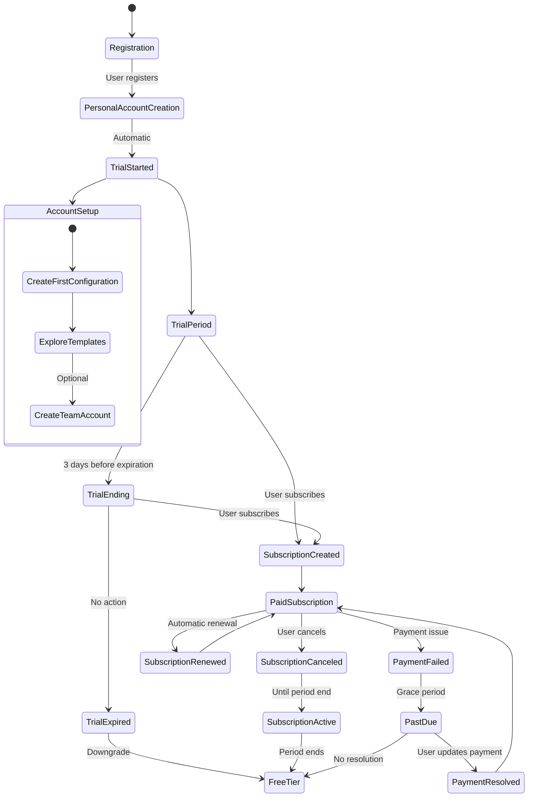
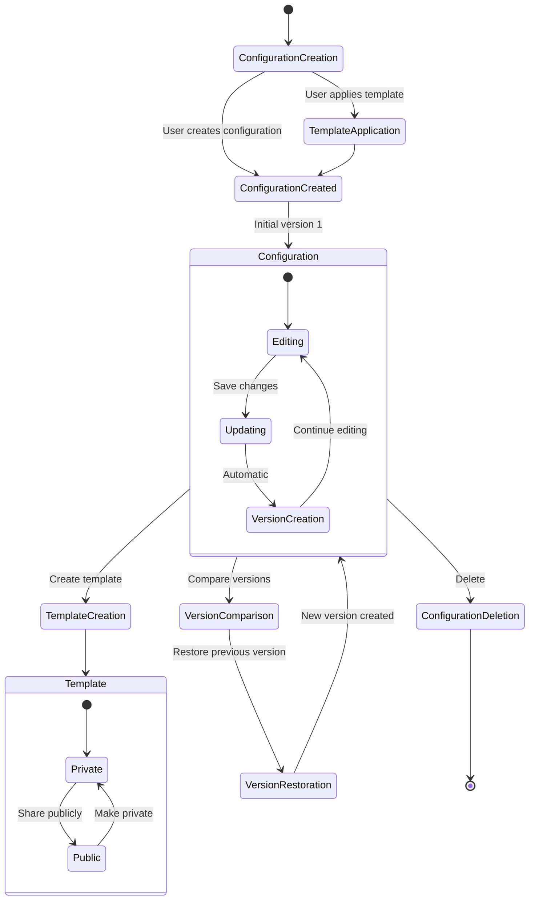
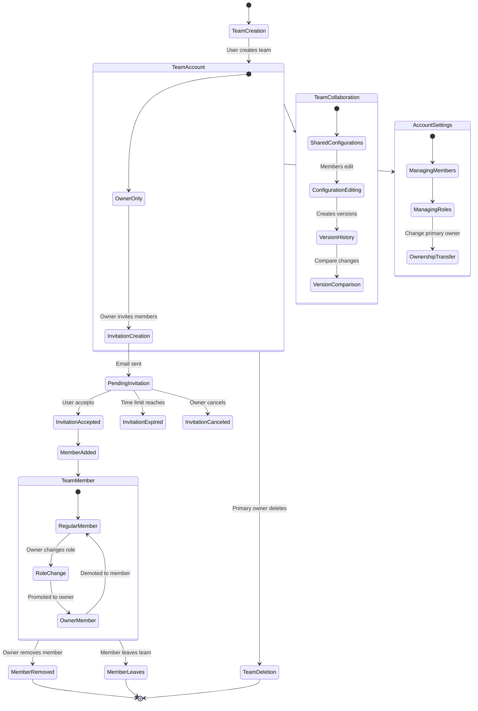

# Key Business Workflows

This section documents the critical business workflows in the Leger system. Each workflow describes a sequence of events, state transitions, and business rules that need to be maintained in the reimplementation.

## User Onboarding Workflow

### Registration & Account Creation

1. **User Registration**
   - User provides email, password, and optional name
   - System validates credentials
   - User record is created in the system
   - Welcome email is sent to the user

2. **Personal Account Creation**
   - System automatically creates a personal account
   - Account is named based on user's name or email
   - User is assigned as primary owner with "owner" role
   - Personal account is flagged (`personal_account = true`)

3. **Trial Activation**
   - 14-day trial period is automatically started
   - Full access to all features is granted
   - Trial expiration date is set to 14 days from registration
   - User is notified of trial status

### Subscription Lifecycle

1. **Trial Period**
   - User has access to all premium features
   - System tracks remaining days in trial
   - Notification is sent when trial is nearing expiration (3 days before)

2. **Subscription Checkout**
   - User initiates subscription checkout
   - System creates Stripe checkout session
   - User completes payment through Stripe
   - Webhook notification confirms subscription creation
   - Account is upgraded to paid status

3. **Subscription Management**
   - User can view current subscription status
   - User can access Stripe Customer Portal to update payment method
   - User can cancel subscription (effective at period end)
   - System processes subscription update webhooks from Stripe

4. **Subscription Termination**
   - User cancels subscription through Stripe portal
   - System marks subscription as `cancel_at_period_end = true`
   - Access continues until end of current period
   - Account downgrades to free tier at period end
   - User can resubscribe at any time

5. **Free Tier Limitations**
   - Maximum 3 configurations allowed
   - Cannot create templates or share configurations
   - Can still access existing configurations
   - Can use public templates created by others

## Configuration Management Workflow

### Configuration Creation

1. **Creating a New Configuration**
   - User selects account to create configuration in
   - User provides name and optional description
   - User inputs initial configuration data (JSON)
   - System creates configuration with version 1
   - System checks subscription quotas before creation
   - Creation is tracked with user ID and timestamp

2. **Applying a Template**
   - User browses available templates
   - User selects a template to apply
   - User provides name and optional description
   - User can override specific template values
   - System creates a new configuration based on template
   - Creation is tracked with user ID and timestamp

### Configuration Editing

1. **Updating a Configuration**
   - User selects configuration to edit
   - User makes changes to configuration data
   - System validates the JSON structure
   - System creates a new version with incremented version number
   - Previous version is preserved in version history
   - Update is tracked with user ID and timestamp

2. **Viewing Version History**
   - User accesses configuration version history
   - System displays all versions with metadata
   - User can view any specific version
   - User can compare any two versions
   - Comparison shows added, removed, and modified keys

3. **Restoring a Version**
   - User selects a previous version to restore
   - User confirms restoration action
   - System creates a new version with the restored data
   - Version number is incremented (not reverted)
   - Restoration action is recorded in version history
   - Restoration is tracked with user ID and timestamp

### Template Management

1. **Creating a Template**
   - User selects existing configuration to templatize
   - User provides template name and description
   - User sets visibility (public or private)
   - System creates a template marked with `is_template = true`
   - System checks subscription status for template creation permission

2. **Managing Template Visibility**
   - User can change template visibility between public and private
   - Public templates (`is_public = true`) are visible to all users
   - Private templates are only visible within the owning account
   - Public templates are discoverable through the template gallery

## Team Collaboration Workflow

### Team Account Management

1. **Creating a Team Account**
   - User provides team name and optional slug
   - System creates team account with `personal_account = false`
   - Creator is assigned as primary owner with "owner" role
   - System tracks creation timestamp

2. **Inviting Team Members**
   - Owner creates invitation specifying:
     - Role (owner or member)
     - Invitation type (one-time or 24-hour)
   - System generates unique invitation token
   - Invitation email is sent to the recipient
   - Invitation is stored with expiration information

3. **Joining a Team**
   - Invitee clicks invitation link in email
   - System validates invitation token
   - Invitee accepts invitation (must be logged in)
   - System creates account membership with specified role
   - Invitation is marked as used

### Member Management

1. **Changing Member Roles**
   - Owner views team members list
   - Owner changes a member's role (owner or member)
   - System updates the account_role in AccountUser
   - System ensures at least one owner remains

2. **Removing Members**
   - Owner selects member to remove
   - System validates (cannot remove primary owner)
   - System removes AccountUser record
   - Member loses access to team resources

3. **Transferring Primary Ownership**
   - Primary owner selects another owner to become primary
   - System validates target user has owner role
   - System updates account.primary_owner_user_id
   - Primary ownership designation is transferred

### Collaborative Configuration Management

1. **Shared Access to Configurations**
   - All team members can view team configurations
   - All team members can edit team configurations
   - System tracks who created/updated each configuration
   - Version history shows which member made each change

2. **Configuration Moderation**
   - Only owners can delete configurations
   - All members can create configurations (subject to quota)
   - Templates can be created by any member (subject to subscription)
   - Public template sharing requires owner approval

## Subscription and Feature Control Workflow

### Feature Access Control

1. **Checking Configuration Quota**
   - Before creating a configuration, system checks current count
   - Free tier: Maximum 3 configurations
   - Paid tier: Maximum 50 configurations
   - System provides clear error message if quota exceeded

2. **Checking Template Creation Permission**
   - Before creating a template, system checks subscription status
   - Requires active subscription or trial
   - System provides clear error message if not authorized

3. **Checking Advanced Feature Access**
   - Before accessing advanced features, system checks subscription
   - Features like version comparison require subscription
   - System provides clear error message with upgrade prompt

### Subscription Status Transitions

1. **Trial to Paid**
   - User subscribes during trial period
   - Trial is immediately ended
   - Paid subscription begins
   - No service interruption

2. **Trial to Free**
   - Trial period ends without subscription
   - Account downgrades to free tier
   - Excess configurations remain accessible but locked
   - Templates become inaccessible for modification

3. **Paid to Free**
   - Subscription is canceled
   - Service continues until period end
   - At period end, account downgrades to free tier
   - Same restrictions apply as trial expiration

4. **Payment Issue Handling**
   - Payment method fails
   - Account enters "past_due" status
   - Grace period provides time to update payment
   - If resolved, subscription continues normally
   - If not resolved, eventually downgrades to free tier

---

# Business Rules and Validation Logic

This section documents the critical business rules and validation logic that must be implemented in the new system.

## User and Account Validation

### User Validation Rules

| Field | Validation Rules |
|-------|------------------|
| `email` | Required, valid email format, unique across all users |
| `password` | Required, minimum 6 characters |
| `name` | Optional, maximum 255 characters |
| `avatar_url` | Optional, valid URL format |

### Account Validation Rules

| Field | Validation Rules |
|-------|------------------|
| `name` | Required, maximum 255 characters |
| `slug` | Optional, URL-safe characters, unique across all accounts, 3-63 characters |
| `personal_account` | Boolean, cannot be changed after creation |
| `primary_owner_user_id` | Required, must reference a valid user with owner role |
| `metadata` | Optional, must be valid JSON |

### Account Membership Rules

1. A user can be a member of multiple accounts simultaneously
2. A user can have only one role (owner or member) per account
3. Personal accounts can have only one member (the owner)
4. A user cannot have duplicate memberships in the same account
5. A team account must always have at least one owner
6. The primary owner cannot be removed from the account
7. Role changes can only be performed by account owners

## Configuration Validation

### Configuration Validation Rules

| Field | Validation Rules |
|-------|------------------|
| `name` | Required, maximum 255 characters |
| `description` | Optional, maximum 1000 characters |
| `config_data` | Required, must be valid JSON |
| `is_template` | Boolean, requires subscription to set to true |
| `is_public` | Boolean, only applicable if is_template is true |
| `version` | Auto-incremented, starts at 1 |

### Configuration Business Rules

1. Each account has a maximum number of configurations:
   - Free tier: 3 configurations maximum
   - Paid tier: 50 configurations maximum
2. Versioning is automatic - each update to config_data creates a new version
3. Version numbers are sequential integers starting from 1
4. Templates can only be created with an active subscription or trial
5. Public templates are accessible to all users
6. Private templates are accessible only to members of the owning account
7. Configurations can only be deleted by account owners
8. All account members can update configurations

## Invitation Validation

### Invitation Validation Rules

| Field | Validation Rules |
|-------|------------------|
| `account_id` | Required, must reference a valid account |
| `token` | Auto-generated, unique, secure random string |
| `account_role` | Required, must be either "owner" or "member" |
| `invitation_type` | Required, must be either "one_time" or "24_hour" |
| `expires_at` | Calculated based on invitation_type |
| `created_by` | Required, must reference a valid user with owner role |

### Invitation Business Rules

1. Only account owners can create invitations
2. "one_time" invitations never expire until used
3. "24_hour" invitations expire 24 hours after creation
4. Invitations can only be used once
5. Expired invitations cannot be accepted
6. Used invitations cannot be reused
7. A user cannot accept an invitation to an account they already belong to
8. Account owners can cancel any pending invitation
9. Email must be sent to notify invitee

## Subscription and Billing Rules

### Subscription Status Rules

1. Valid subscription statuses:
   - `active`: Subscription is active and paid
   - `trialing`: In trial period
   - `past_due`: Payment failed but subscription still active
   - `canceled`: Subscription canceled
   - `incomplete`: Initial payment failed
   - `incomplete_expired`: Initial payment failed and expired
   - `no_subscription`: Not a database status, represents free tier

2. Full feature access is granted when:
   - Status is `active`
   - Status is `trialing`

3. Limited feature access when:
   - Status is anything else
   - Free tier users can still access existing configurations
   - Free tier users can still view public templates

### Feature Access Rules

| Feature | Free Tier | Paid Tier | Trial |
|---------|-----------|-----------|-------|
| Create configurations | Limited to 3 | Limited to 50 | Limited to 50 |
| Edit configurations | Yes | Yes | Yes |
| View version history | Yes | Yes | Yes |
| Compare versions | No | Yes | Yes |
| Create templates | No | Yes | Yes |
| Public templates | View only | Create & view | Create & view |
| Team accounts | Create & join | Create & join | Create & join |

### Subscription Transition Rules

1. New users automatically receive a 14-day trial
2. Trial users have full access to all features
3. Trial expiration downgrades to free tier
4. Subscribing during trial immediately activates paid status
5. Canceling subscription takes effect at period end
6. Payment failures enter "past_due" status with grace period
7. Unresolved payment issues eventually downgrade to free tier
8. Resubscribing restores full access immediately

## Webhook Validation

### Webhook Signature Validation

1. All Stripe webhooks must include a valid signature header
2. Signature must be verified using the webhook secret
3. Events with invalid signatures must be rejected
4. Webhook processing must be idempotent (handle duplicate events)

### Webhook Event Validation

1. Only process known event types
2. Verify account relationship for customer/subscription events
3. Log all webhook events before processing
4. Maintain audit trail of webhook processing

## Error Handling Rules

1. User-facing errors should be clear and actionable
2. Security-sensitive errors should not reveal implementation details
3. Authentication errors should have consistent responses
4. Permission errors should clearly indicate required access level
5. Subscription-related errors should include upgrade information
6. Validation errors should specify which fields failed and why
7. Rate limiting should be applied to prevent abuse
8. API responses should use appropriate HTTP status codes

## Rate Limiting Rules

| Endpoint Type | Rate Limit |
|---------------|------------|
| Public endpoints | 60 requests per minute per IP |
| Authentication endpoints | 10 requests per minute per IP |
| Standard API endpoints | 30 requests per minute per authenticated user |
| Webhook endpoint | Unlimited (from Stripe IPs only) |

## Data Integrity Rules

1. Version history must be immutable once created
2. Configuration data must be valid JSON
3. Deleted configurations cannot be recovered
4. Account membership changes must maintain integrity constraints:
   - Cannot remove last owner
   - Cannot demote primary owner
   - Cannot remove primary owner
5. Subscription status changes must be logged for audit trail
6. Webhook events must be logged before processing

These business rules and validation logic represent the core integrity constraints and business logic that must be maintained in the new implementation.

---

### User Onboarding Workflow

### Configuration Management Workflow

### Team Collaboration Workflow

