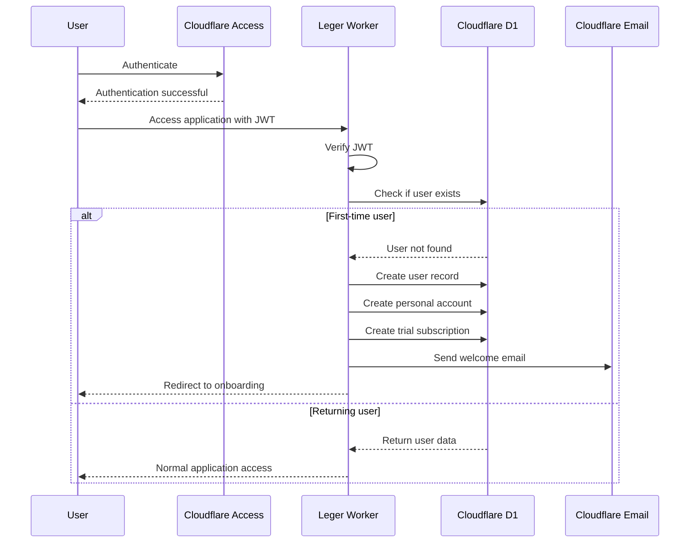
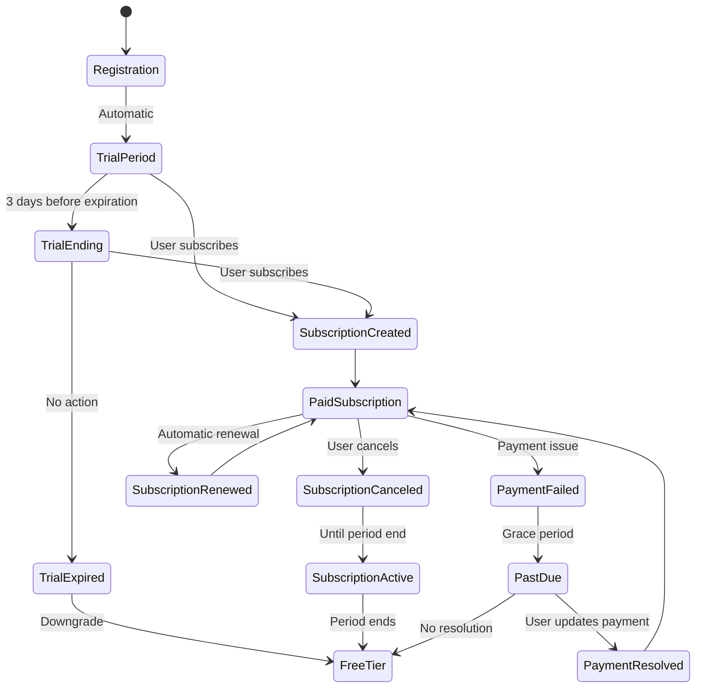
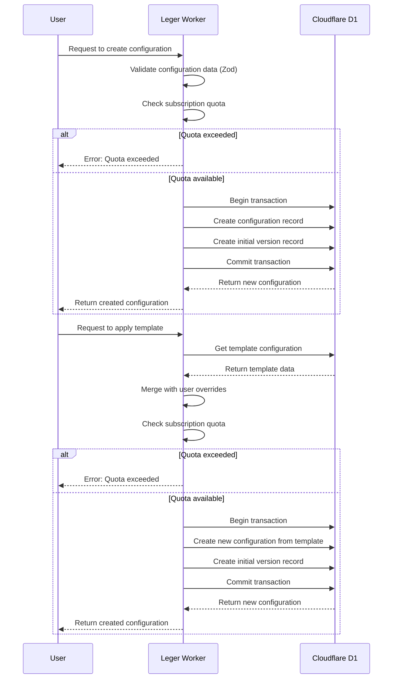
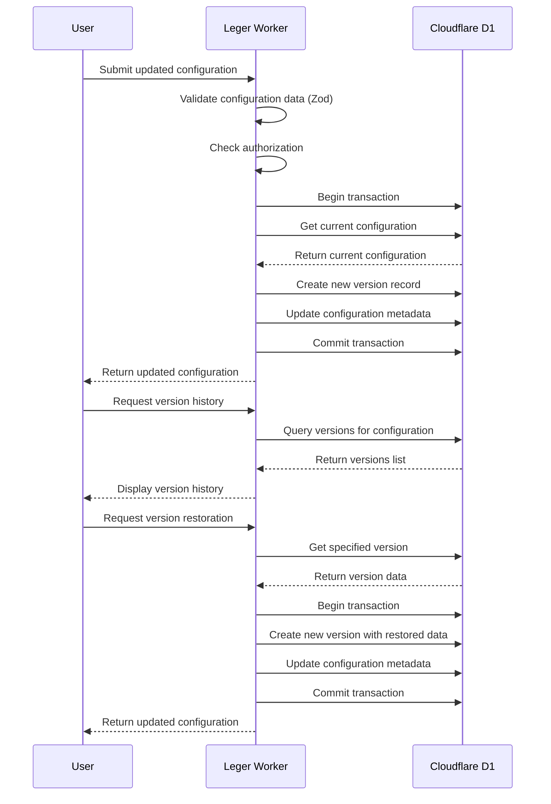
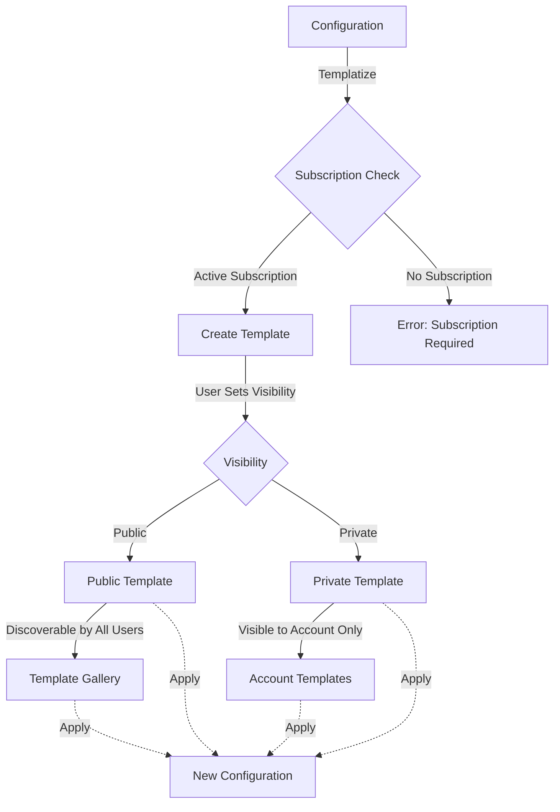
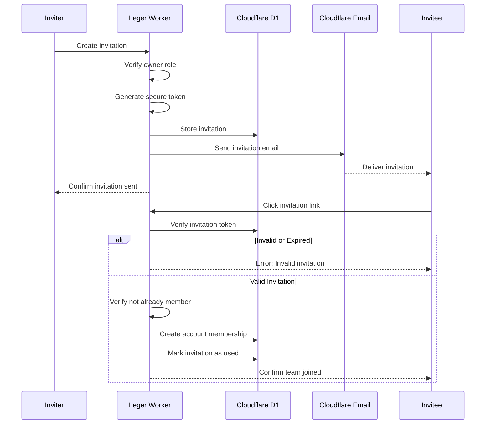
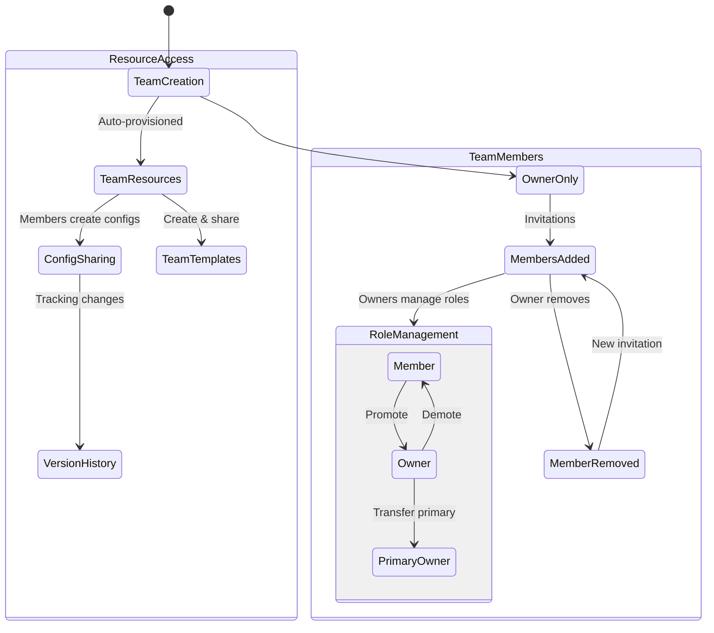
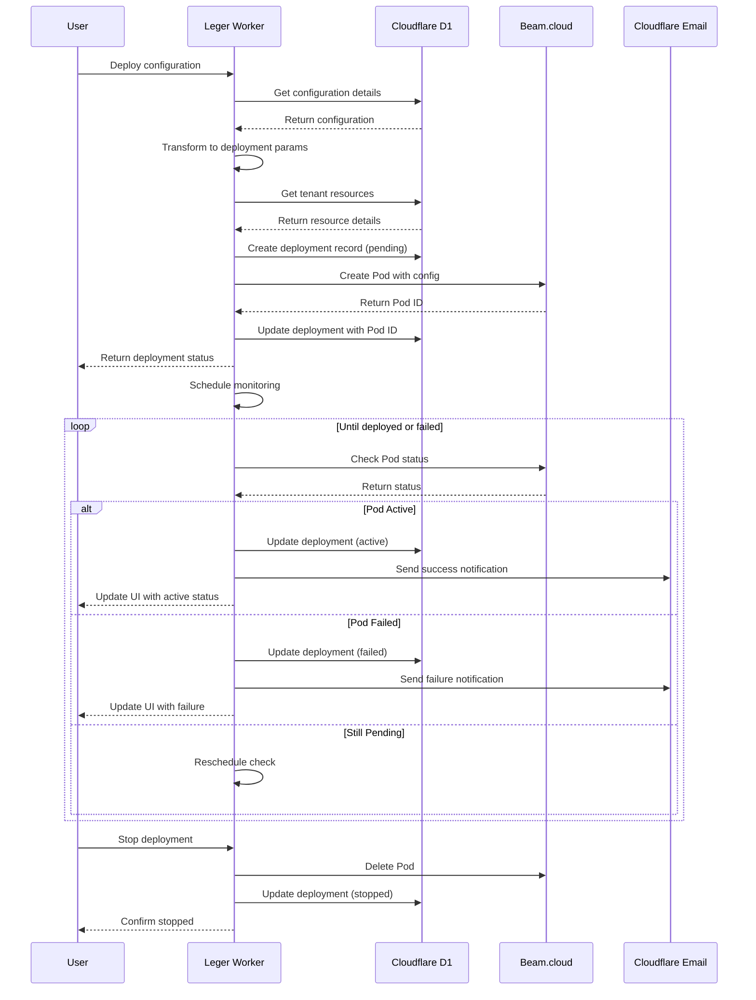
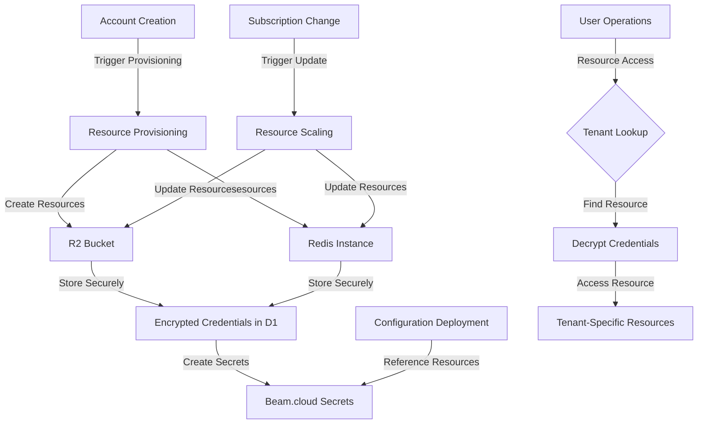
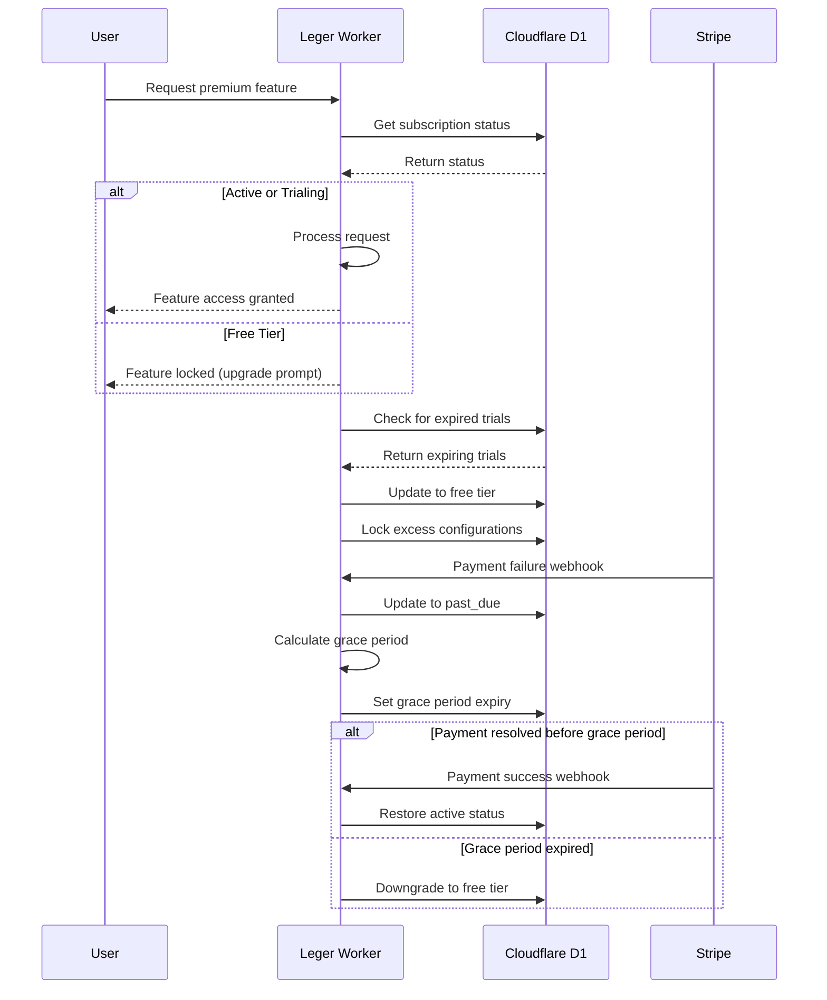

# Key Business Workflows

This document outlines the critical business workflows in the Leger system. Each workflow describes a sequence of events, state transitions, and business rules that are implemented within the single Cloudflare Worker architecture.

## User Onboarding Workflow

### User Registration & Account Creation

1. **User Authentication**
   - User authenticates through Cloudflare Access
   - Worker receives authenticated request with JWT
   - Worker extracts user information from JWT
   - If first-time user, create user record

2. **Personal Account Creation**
   - Worker automatically creates a personal account for new users
   - Account is named based on user's name or email from JWT
   - User is assigned as primary owner with "owner" role
   - Personal account is flagged (`personal_account = true`)

3. **Trial Activation**
   - 14-day trial period is automatically started
   - Full access to all features is granted
   - Trial expiration date is set to 14 days from registration
   - User is notified of trial status

### Subscription Lifecycle

1. **Trial Period**
   - User has access to all premium features
   - Worker tracks remaining days in trial
   - Notification is sent when trial is nearing expiration (3 days before)

2. **Subscription Checkout**
   - User initiates subscription checkout
   - Worker creates Stripe checkout session
   - User completes payment through Stripe
   - Stripe sends webhook notification
   - Worker updates subscription status in D1
   - Account is upgraded to paid status

3. **Subscription Management**
   - User can view current subscription status
   - User can access Stripe Customer Portal to update payment method
   - User can cancel subscription (effective at period end)
   - Worker processes subscription update webhooks from Stripe

4. **Subscription Termination**
   - User cancels subscription through Stripe portal
   - Stripe sends webhook notification
   - Worker marks subscription as `cancel_at_period_end = true`
   - Access continues until end of current period
   - Account downgrades to free tier at period end
   - User can resubscribe at any time

5. **Free Tier Limitations**
   - Maximum 3 configurations allowed
   - Cannot create templates or share configurations
   - Can still access existing configurations
   - Can use public templates created by others

## Configuration Management Workflow

### Configuration Creation

1. **Creating a New Configuration**
   - User selects account to create configuration in
   - User provides name and optional description
   - User inputs initial configuration data (JSON)
   - Worker validates input using Zod schema
   - Worker creates configuration in D1 with version 1
   - Worker checks subscription quotas before creation
   - Creation is tracked with user ID and timestamp

2. **Applying a Template**
   - User browses available templates
   - User selects a template to apply
   - User provides name and optional description
   - User can override specific template values
   - Worker creates a new configuration based on template
   - Creation is tracked with user ID and timestamp

### Configuration Editing

1. **Updating a Configuration**
   - User selects configuration to edit
   - User makes changes to configuration data
   - Worker validates the JSON structure using Zod
   - Worker creates a new version with incremented version number
   - Previous version is preserved in version history
   - Update is tracked with user ID and timestamp

2. **Viewing Version History**
   - User accesses configuration version history
   - Worker retrieves all versions with metadata
   - User can view any specific version
   - User can compare any two versions
   - Comparison shows added, removed, and modified keys

3. **Restoring a Version**
   - User selects a previous version to restore
   - User confirms restoration action
   - Worker creates a new version with the restored data
   - Version number is incremented (not reverted)
   - Restoration action is recorded in version history
   - Restoration is tracked with user ID and timestamp

### Template Management

1. **Creating a Template**
   - User selects existing configuration to templatize
   - User provides template name and description
   - User sets visibility (public or private)
   - Worker creates a template marked with `is_template = true`
   - Worker checks subscription status for template creation permission

2. **Managing Template Visibility**
   - User can change template visibility between public and private
   - Public templates (`is_public = true`) are visible to all users
   - Private templates are only visible within the owning account
   - Public templates are discoverable through the template gallery

## Team Collaboration Workflow

### Team Account Management

1. **Creating a Team Account**
   - User provides team name and optional slug
   - Worker creates team account with `personal_account = false`
   - Creator is assigned as primary owner with "owner" role
   - Worker tracks creation timestamp

2. **Inviting Team Members**
   - Owner creates invitation specifying:
     - Role (owner or member)
     - Invitation type (one-time or 24-hour)
   - Worker generates unique invitation token
   - Cloudflare Email Workers sends invitation email to recipient
   - Invitation is stored with expiration information

3. **Joining a Team**
   - Invitee clicks invitation link in email
   - Worker validates invitation token
   - Invitee accepts invitation (must be authenticated via Cloudflare Access)
   - Worker creates account membership with specified role
   - Invitation is marked as used

### Member Management

1. **Changing Member Roles**
   - Owner views team members list
   - Owner changes a member's role (owner or member)
   - Worker updates the account_role in AccountUser
   - Worker ensures at least one owner remains

2. **Removing Members**
   - Owner selects member to remove
   - Worker validates (cannot remove primary owner)
   - Worker removes AccountUser record
   - Member loses access to team resources

3. **Transferring Primary Ownership**
   - Primary owner selects another owner to become primary
   - Worker validates target user has owner role
   - Worker updates account.primary_owner_user_id
   - Primary ownership designation is transferred

### Collaborative Configuration Management

1. **Shared Access to Configurations**
   - All team members can view team configurations
   - All team members can edit team configurations
   - Worker tracks who created/updated each configuration
   - Version history shows which member made each change

2. **Configuration Moderation**
   - Only owners can delete configurations
   - All members can create configurations (subject to quota)
   - Templates can be created by any member (subject to subscription)
   - Public template sharing requires owner approval

## Deployment Workflow

1. **Configuration Deployment**
   - User selects configuration to deploy
   - Worker validates configuration completeness
   - Worker transforms configuration to deployment parameters
   - Worker calls Beam.cloud API to create Pod
   - Worker records deployment status in D1
   - Worker monitors deployment until active or failed

2. **Environment Setup**
   - Worker maps configuration values to environment variables
   - Worker includes tenant-specific resource credentials
   - Sensitive values are replaced with Beam.cloud secret references
   - Worker generates appropriate resource constraints (CPU, memory)

3. **Deployment Management**
   - User can view active deployments for their account
   - User can stop running deployments
   - Worker updates deployment status based on Beam.cloud events
   - Worker cleans up resources when deployments are stopped

## Multi-Tenant Resource Provisioning Workflow

1. **Account Creation Triggers Provisioning**
   - When a new account is created, resource provisioning begins
   - Worker provisions dedicated R2 bucket
   - Worker provisions dedicated Upstash Redis instance
   - Resource credentials are stored securely in D1
   - Corresponding secrets are created in Beam.cloud

2. **Resource Access Flow**
   - When an operation requires tenant-specific resources
   - Worker looks up resource mapping for the tenant
   - Worker retrieves and decrypts credentials
   - Worker connects to appropriate tenant resource
   - Complete isolation ensures security between tenants

3. **Resource Scaling**
   - Resources are scaled based on subscription tier
   - Paid tier accounts get higher capacity resources
   - Free tier accounts get limited resources
   - Resource upgrades happen automatically on subscription changes

## Subscription and Feature Control Workflow

### Feature Access Control

1. **Checking Configuration Quota**
   - Before creating a configuration, Worker checks current count
   - Free tier: Maximum 3 configurations
   - Paid tier: Maximum 50 configurations
   - Worker provides clear error message if quota exceeded

2. **Checking Template Creation Permission**
   - Before creating a template, Worker checks subscription status
   - Requires active subscription or trial
   - Worker provides clear error message if not authorized

3. **Checking Advanced Feature Access**
   - Before accessing advanced features, Worker checks subscription
   - Features like version comparison require subscription
   - Worker provides clear error message with upgrade prompt

### Subscription Status Transitions

1. **Trial to Paid**
   - User subscribes during trial period
   - Stripe webhook notifies of subscription creation
   - Worker ends trial and activates paid subscription
   - No service interruption

2. **Trial to Free**
   - Trial period ends without subscription
   - Worker downgrades account to free tier
   - Excess configurations remain accessible but locked
   - Templates become inaccessible for modification

3. **Paid to Free**
   - Subscription is canceled via Stripe
   - Service continues until period end
   - At period end, Worker downgrades to free tier
   - Same restrictions apply as trial expiration

4. **Payment Issue Handling**
   - Payment method fails
   - Stripe webhook notifies of payment failure
   - Worker updates account to "past_due" status
   - Grace period provides time to update payment
   - If resolved, subscription continues normally
   - If not resolved, eventually downgrades to free tier

These workflows define the complete lifecycle of key business processes in the Leger system. They are implemented within the single Cloudflare Worker architecture, with appropriate domain separation to maintain clean boundaries between business concerns while providing a cohesive user experience.
