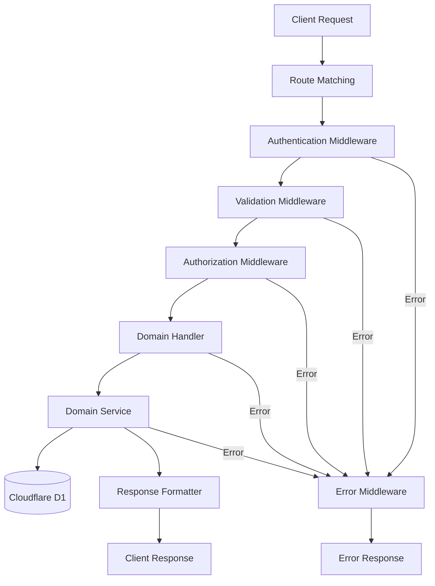
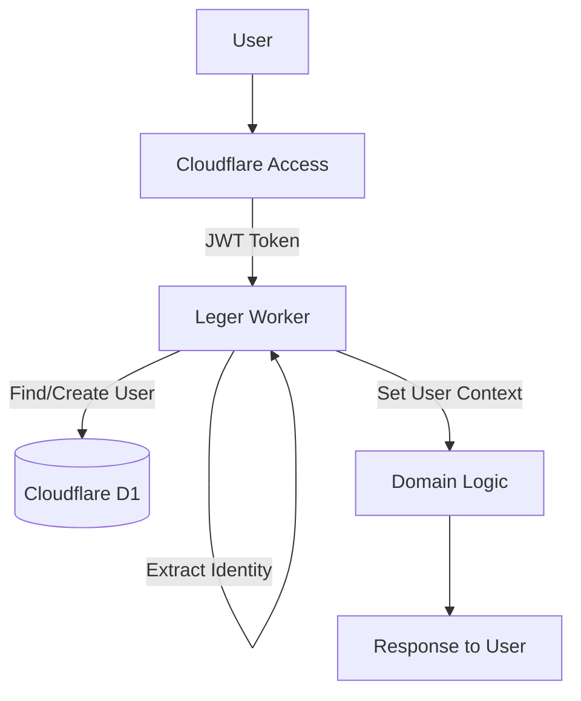

# Additional Implementation Considerations

This document provides additional implementation considerations and recommendations for the Leger platform based on analysis of the Cloudflare SaaS Stack and best practices for Cloudflare Worker architectures.

## Cloudflare Worker Architecture Recommendations

After reviewing the Leger project documentation and the Cloudflare SaaS Stack codebase, we've identified several architectural patterns and implementation approaches that would enhance Leger's single Cloudflare Worker architecture. These recommendations focus on maximizing the benefits of Cloudflare's platform while maintaining Leger's domain-driven design approach.

### Single Worker Request Processing Pipeline

Implement a structured request processing pipeline that handles all aspects of request handling consistently:



This pipeline ensures:
- Consistent authentication via Cloudflare Access
- Standardized validation using shared Zod schemas
- Proper authorization checks before business logic execution
- Uniform error handling throughout the request lifecycle

### Domain-Driven Code Organization

Structure the Worker code by business domain rather than technical layer:

```
├── domains/                  # Business domains
│   ├── auth/                 # Authentication and user management
│   │   ├── handlers.ts       # Route handlers for auth endpoints
│   │   ├── service.ts        # Authentication business logic
│   │   └── types.ts          # Auth-specific type definitions
│   ├── accounts/             # Account management
│   ├── configurations/       # Configuration management
│   ├── versions/             # Version management
│   ├── billing/              # Billing and subscription
│   ├── deployments/          # Beam.cloud deployments
│   └── resources/            # Multi-tenant resources
├── middleware/               # Request middleware
│   ├── auth.ts               # Authentication middleware
│   ├── validation.ts         # Request validation middleware
│   ├── error.ts              # Error handling middleware
│   └── cors.ts               # CORS handling
├── db/                       # Database with Drizzle ORM
│   ├── schema/               # Drizzle schema definitions
│   ├── migrations/           # D1 migrations
│   └── index.ts              # DB client setup
├── utils/                    # Utility functions
├── index.ts                  # Worker entry point
└── types.ts                  # Global type definitions
```

This organization ensures:
- Clear boundaries between business domains
- Domain-specific code remains cohesive
- Shared infrastructure can be reused across domains
- New domains can be added without affecting existing ones

### Efficient Drizzle ORM Patterns

Implement Drizzle ORM patterns optimized for Cloudflare D1:

1. **Connection Management**: Efficient reuse of database connections
2. **Transaction Patterns**: Consistent approach to transaction-based operations
3. **Query Optimization**: Selective field loading and join minimization
4. **Repository Pattern**: Domain-specific repositories that encapsulate database operations
5. **Error Handling**: Consistent handling of database errors with proper mapping to domain errors

These patterns ensure efficient, reliable database operations in the Cloudflare D1 environment.

### Multi-Tenant Resource Provisioning

Implement a robust resource provisioning system that ensures tenant isolation:

1. **Provisioning Workflow**: Clear workflow for resource creation and management
2. **Resource Isolation**: Complete isolation between tenant resources
3. **Credential Management**: Secure handling of resource credentials
4. **Resource Lifecycle**: Proper management of resource lifecycle from creation to deletion
5. **Resource Monitoring**: Comprehensive monitoring of resource health and usage

This approach ensures secure multi-tenant operation while maintaining operational simplicity.

### Error Handling Architecture

Implement a comprehensive error handling architecture:

1. **Error Classification**: Categorize errors by type and domain
2. **Error Propagation**: Structured approach to error propagation through layers
3. **Error Enrichment**: Add context to errors as they propagate
4. **Centralized Formatting**: Format errors consistently in middleware layer
5. **User-Friendly Messages**: Present clear, actionable error messages to users

This architecture ensures errors are properly captured, communicated, and addressed.

### Edge Caching Strategy

Implement a strategic caching approach for optimal performance:

1. **Cache Layers**: Multiple cache layers from edge to application
2. **Cache Policies**: Clear policies for what should be cached and for how long
3. **Cache Invalidation**: Explicit invalidation of cache entries when data changes
4. **Cache Headers**: Proper cache headers for browser and edge caching
5. **Cache Monitoring**: Visibility into cache effectiveness

This strategy balances performance with data freshness across the application.

### Worker Optimization Techniques

Implement several key optimizations for Worker performance:

1. **Cold Start Optimization**: Minimize dependencies to reduce cold start times
2. **Memory Management**: Careful management of memory within Worker constraints
3. **Code Splitting**: Strategic code splitting to keep bundle size manageable
4. **Asynchronous Processing**: Proper use of async/await patterns
5. **Resource Pooling**: Efficient reuse of expensive resources

These techniques ensure the Worker remains responsive even under high load.

### Background Processing Architecture

Implement a pattern for handling long-running operations:

1. **Task Queuing**: Queue non-critical operations for asynchronous processing
2. **Worker Queues**: Use Cloudflare queues or similar for background tasks
3. **Status Tracking**: Track operation status in the database
4. **Result Communication**: Communicate operation results to users
5. **Retry Mechanisms**: Automatically retry failed operations with backoff

This architecture keeps the main request handling responsive while ensuring complex operations complete reliably.

### Deployment and CI/CD Strategy

Implement a GitHub-centered deployment strategy:

1. **GitHub Actions**: Automate testing, building, and deployment
2. **Preview Deployments**: Create preview deployments for pull requests
3. **Environment Management**: Manage different environments (development, staging, production)
4. **Release Process**: Clear process for releasing new versions
5. **Rollback Capability**: Ability to quickly rollback problematic deployments

This strategy ensures reliable, consistent deployments with minimal manual intervention.

## Cloudflare Access Authentication Implementation

This section provides detailed recommendations for implementing a robust authentication system using Cloudflare Access within the Leger platform.

### Authentication Architecture Overview

Cloudflare Access provides a robust, secure authentication system that runs at the edge and integrates with your application's user management system:



### Key Implementation Components

#### 1. JWT Verification Module

Implement a dedicated module for JWT verification with these key features:

- **JWKS Caching**: Cache JWKS keys with appropriate TTL
- **Verification Caching**: Cache verification results briefly
- **Audience Validation**: Verify token audience matches your application
- **Expiration Checking**: Enforce token expiration with small clock skew allowance
- **Algorithm Restriction**: Accept only secure signing algorithms

#### 2. User Identity Management

Implement a comprehensive identity management system:

- **Just-In-Time Provisioning**: Automatically create user records on first authentication
- **Identity Mapping**: Map Cloudflare identity to internal user records
- **Profile Synchronization**: Keep user profile data in sync with Cloudflare 
- **Email Verification**: Trust Cloudflare's email verification
- **Conflict Resolution**: Handle edge cases like email changes

#### 3. Authorization Framework

Build a robust authorization framework on top of authentication:

- **Role-Based Access Control**: Define clear roles with associated permissions
- **Resource Ownership**: Track ownership of resources for authorization
- **Context-Aware Permissions**: Adjust permissions based on request context
- **Permission Caching**: Cache authorization decisions for performance
- **Audit Logging**: Log all significant authorization decisions

#### 4. Authentication Middleware

Implement authentication middleware that:

- **Extracts JWT**: Gets the JWT from the CF-Access-JWT-Assertion header
- **Verifies Token**: Validates the token cryptographically
- **Sets User Context**: Establishes user identity for the request
- **Handles Failures**: Returns appropriate errors for authentication failures
- **Bypasses Public Routes**: Skips authentication for public endpoints

### Implementation Strategy

#### Authentication Middleware

The authentication middleware is the entry point for authentication processing:

1. Skip authentication for public routes
2. Extract the JWT token from the CF-Access-JWT-Assertion header
3. Verify the JWT signature and validate claims
4. Get or create the user record in the database
5. Set user context for downstream handlers
6. Return appropriate error response for authentication failures

#### JWT Verification Module

Create a robust JWT verification module with proper caching:

1. Cache JWKS keys in KV store with appropriate TTL
2. Implement JWT signature verification
3. Validate required claims (iss, aud, exp, etc.)
4. Cache verification results briefly to improve performance

#### User Management Service

Implement a user management service:

1. Create users automatically when they first authenticate
2. Update user details when they change in Cloudflare Access
3. Handle edge cases like email changes
4. Implement user profile management
5. Provide consistent user identification across the application

#### Authorization Service

Build an authorization service on top of authentication:

1. Define clear permission model based on user roles
2. Implement resource-specific permissions
3. Create helper functions for common authorization checks
4. Integrate authorization checks into domain handlers
5. Log authorization decisions for audit purposes

### Security Considerations

Implement these security best practices:

1. **JWT Validation**: Thoroughly validate all aspects of the JWT
2. **Secure Headers**: Implement appropriate security headers
3. **CORS Configuration**: Configure CORS appropriately for your authentication flow
4. **Error Messages**: Provide minimal information in authentication error messages
5. **Access Policies**: Configure appropriate access policies in Cloudflare Access dashboard
6. **Token Storage**: Secure handling of tokens on the client side
7. **Regular Security Reviews**: Periodically review authentication implementation

By implementing these recommendations, you can build a robust, secure Cloudflare Worker architecture that fully leverages Cloudflare's edge computing capabilities while maintaining your domain-driven design and business logic integrity.
